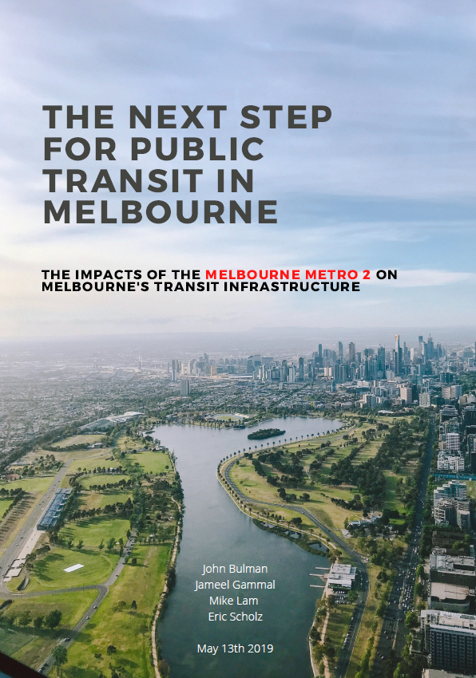
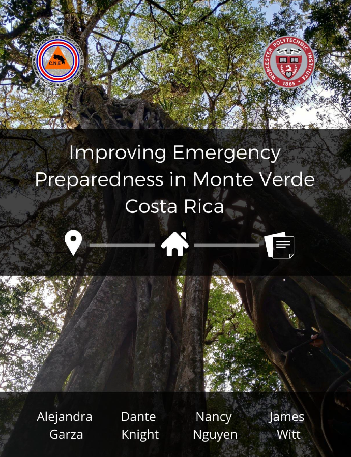
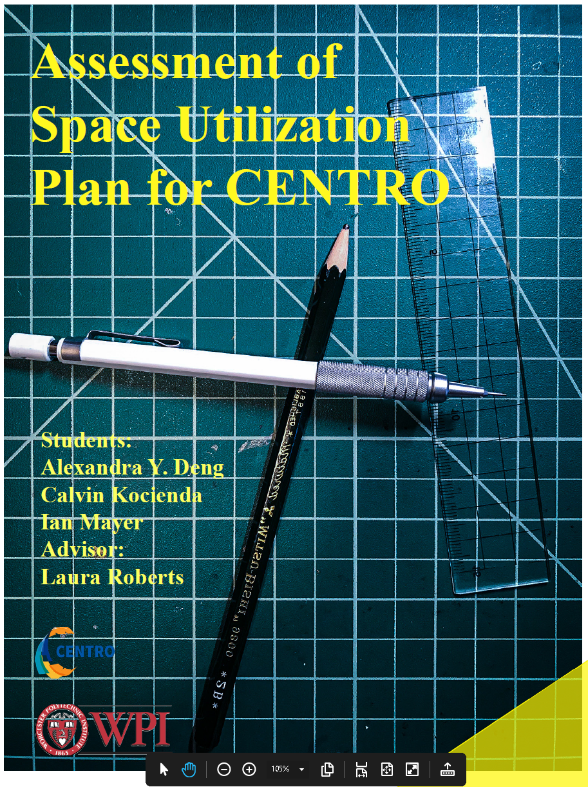
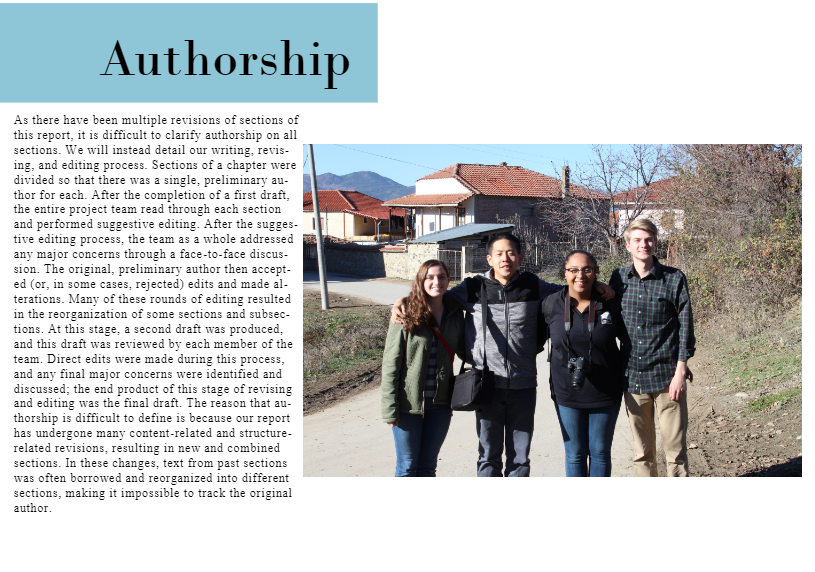
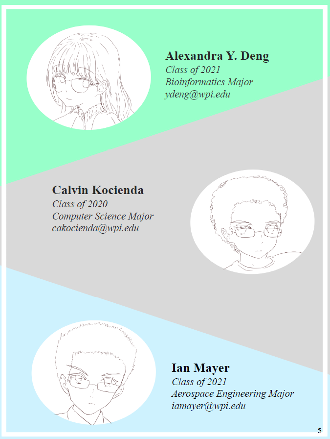
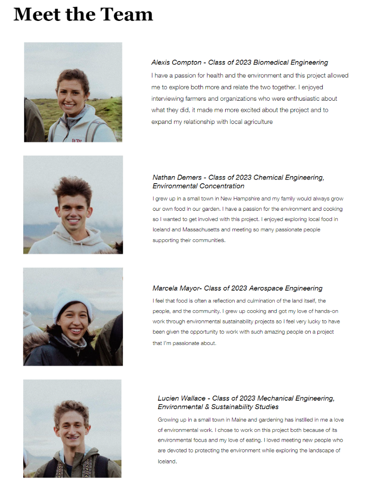

# Appendices

## Appendix A: Cover Page Examples

{: style="width:2.99648in;height:4.25in" }
{: style="width:2.98in;height:4.25in" }
{: style="width:3.25in;height:4.23438in" }
{: style="width:3.25in;height:4.33912in" }

## Appendix B: Required WPI Title Page for Final Report

***Project Title***

An Interactive Qualifying Project submitted to the Faculty of

WORCESTER POLYTECHNIC INSTITUTE

in partial fulfilment of the requirements for the degree of Bachelor of
Science/Arts.

by

Author Name A

Author Name B

Author Name C

Date:

Day Month Year

Report Submitted to:

Sponsor Liaison(s)

Sponsoring Organization

Professors Name A and Name B

Worcester Polytechnic Institute

*This report represents work of WPI undergraduate students submitted to
the faculty as evidence of a degree requirement. WPI routinely publishes
these reports on its web site without editorial or peer review. For more
information about the projects program at WPI, see
[<u>http://www.wpi.edu/Academics/Projects</u>](http://www.wpi.edu/Academics/Projects).*

## Appendix C: Example Final Report Authorship

Please note: Your Proposal should use an Authorship Table as described
in [section 4.2](chapter-4-completing/proposal.md#authorship-table).

{: style="width:5.88403in;height:4.13021in" }

## Appendix D: Example Meet the Team Pages

{: style="width:3.39021in;height:4.5in" }
{: style="width:3.41576in;height:4.5in" }
