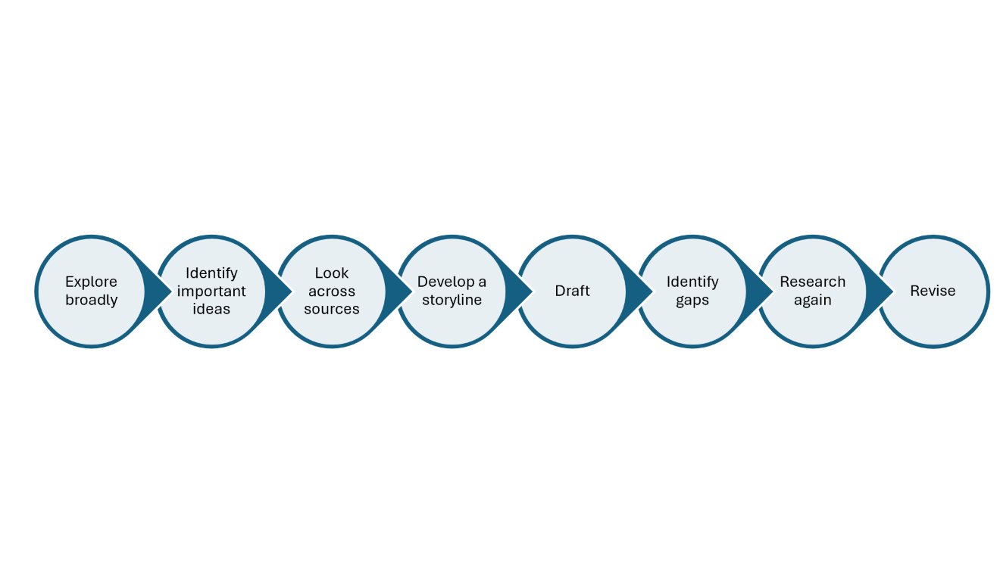
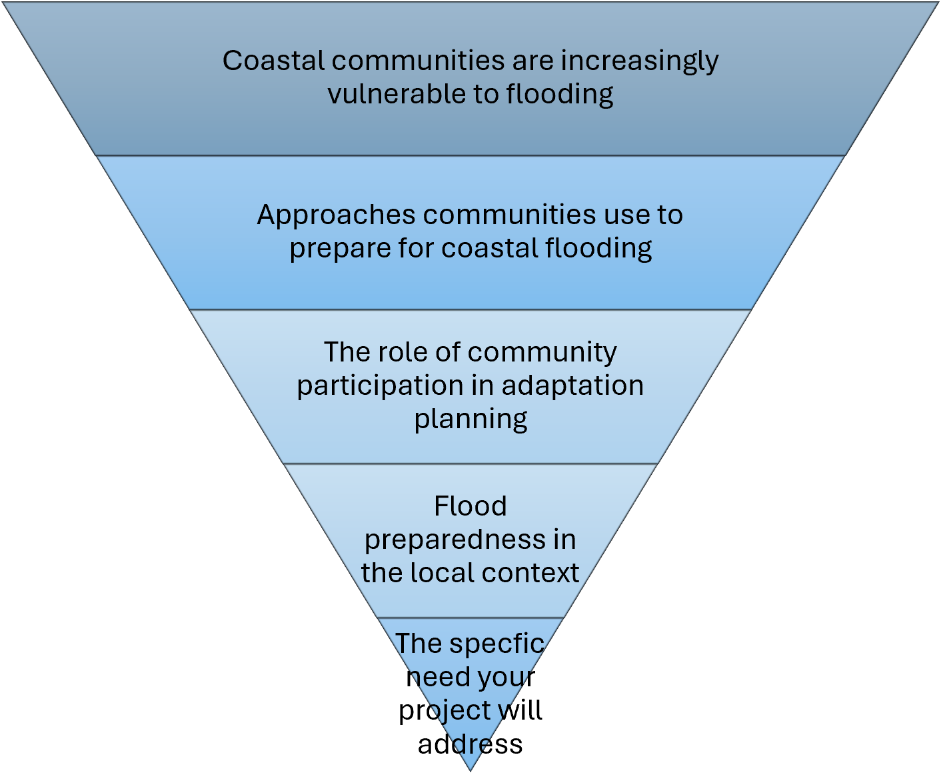
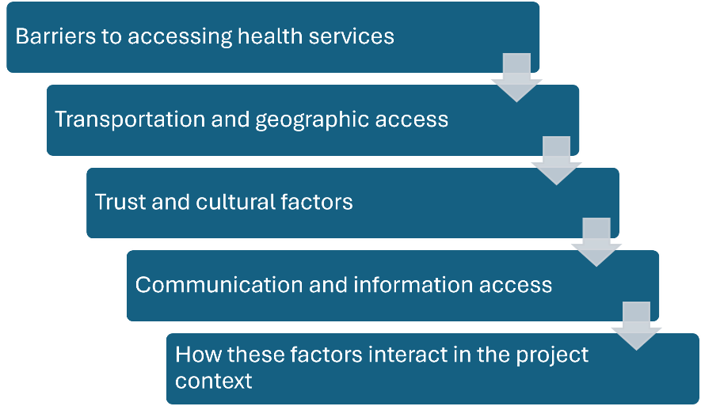

# 2.2 Background Chapter

## What is the purpose of the Background Chapter?

The Background Chapter provides the research and context needed to
understand your project. Depending on the project, this may include
research about the larger issue, the local context, important
stakeholders and their perspectives, previous efforts to address the
problem, and approaches used in other places or contexts.

You may also hear this chapter referred to as a literature review. In
this guide, I use the term *Background*, but you can think of
*Background* and *literature review* as referring to the same general
part of your research report. In both cases, the goal is to bring
together and synthesize existing research and knowledge related to your
project.

The purpose of the Background can change as you move from your ID2050
proposal to your final report. During ID2050, the process of researching
the Background is an important part of how your team prepares for the
project. You will likely begin with limited knowledge about the topic,
local context, stakeholders, or approaches others have used to address
similar problems. Background research helps your team come up to speed
on the project and develop the knowledge you need to make informed
decisions about your research. You then use what you have learned to
write a formal Background chapter.

By the time you write your final report, you have developed a much
deeper understanding of the project and the purpose of the Background
shifts toward your reader. In your final report, your Background will
provide readers with the context they need to understand your project,
research, findings, and recommendations. This is why you will revisit
and revise your Background during your IQP term.

**Purpose of the Background Chapter**

| **ID2050 Proposal** | **IQP Final Report** |
|----|----|
| Help your team come up to speed on the topic and develop the knowledge needed to plan and conduct your research. | Help your reader understand the context and existing knowledge needed to make sense of the project and the research you completed. |

## Researching for your Background Chapter

Developing your Background is an iterative process. You will not know
everything you need to research at the beginning, and you do not need to
finish your research before you start writing. What you learn will lead
to new questions, and writing will often help you identify gaps in your
understanding.

**The Research and Writing Process**

As you work through this process, look for patterns, different
perspectives, areas of agreement and disagreement, previous approaches,
and questions that remain unresolved. The goal is to move from
collecting information to making sense of what you are learning. You
will probably move back and forth among these steps rather than
following them once in order. That is part of the research and writing
process.

{: style="width:6in;height:0.95833in" }

## Synthesizing Your Research

A strong Background is organized around ideas rather than individual
sources. Your sources provide evidence for the ideas you are developing,
but the sources themselves should not determine the organization of the
chapter. As you write, look across your research. *Where do sources
agree or disagree? What patterns emerge? What different perspectives are
represented? What does the research collectively help you understand
about the issue?*

Instead of writing a paragraph about one source followed by a paragraph
about another, bring information from multiple sources together to
develop the ideas your reader needs to understand.

The goal is to move from reporting what individual sources say to
synthesizing what the research helps us understand about the issue.

## Organizing Your Background

{: style="width:4.27847in;height:3.54792in" } There is no single correct
way to organize a Background chapter. Choosing the structure is one of
the important decisions your team will make. Think about the story your
Background needs to tell. *What does your reader need to understand
first? What information builds on that understanding? How should the
chapter eventually lead toward the research your team will conduct?*

The following structures are useful starting points, but they are not
required formats.

### The Funnel

A funnel moves from the broader issue toward the specific context of
your project. A funnel works well when your reader first needs to
understand a larger issue before they can understand the specific local
problem. The important question is not simply whether you can move from
broad to narrow.

Ask:

*Does understanding each section help the reader understand why the next
section matters?*

### The Sandwich

Sometimes readers need to understand the local context before the
broader research will make sense. In this case, a sandwich structure may
work better.

{: style="width:3.35417in;height:2.88889in" }

The community and its current waste-management challenge\
↓\
Research on household waste behaviors\
↓\
Approaches used in other communities\
↓\
What is known about participation and behavior change\
↓\
What this research suggests for the local project

Here, you begin with the specific local context, step back to consider
broader research and examples, and then return to the project context
with a stronger understanding of it. A sandwich structure can be useful
when the project is strongly grounded in a particular place,
organization, or community and readers need that context to understand
why the broader research is relevant.

{: style="width:4.01877in;height:2.35417in" }

### A Thematic Structure

For some projects, there is no obvious broad-to-narrow sequence.
Instead, readers may need to understand several connected dimensions of
a problem.

A thematic structure can work well when several related issues or
perspectives need to be understood together.

### Other Organization Options

Funnel, sandwich, and thematic are potential structures and not firm
rules for how to organize your background chapter. Your project may need
a variation, a combination of these approaches, or a different structure
entirely. Whatever approach you choose, your team should be able to
explain the logic behind the flow, and you should ensure that your
writing includes transitions that help the reader understand the
connection as you move from one section to the next.

You can use descriptive section headings to help make that structure
visible. Your headings should tell readers something about the ideas in
the section rather than simply label broad categories such as *Previous
Research* or *Project Host*. The Background should ultimately bring your
reader to the point where your own research follows logically from what
is already known and what still needs to be understood.

## Related Guidance

Several other parts of this guide address research and writing skills
that you will use when developing your Background. You can refer to
these sections as needed when you are writing your background chapter.

- Quoting, Paraphrasing, and Summarizing: [Section 5.4](../chapter-5-documenting/citations.md#quoting-paraphrasing-and-summarizing)

- Citations and References: [Section 5.4](../chapter-5-documenting/citations.md)

- Using AI in Research and Writing: [Section 5.4](../chapter-5-documenting/citations.md#ai-generated-content-and-sources)

## Writing Your Proposal Background

The background chapter in your proposal represents what your team
understands before beginning your IQP. The process of conducting
background research should help you come up to speed on the major issues
surrounding your project and make informed decisions about the research
you plan to conduct. By the end of ID2050, your Background should
formally synthesize what your team has learned and provide a strong
foundation for your proposed research.

## Writing Your Final Report Background

Your proposal Background gives you a strong starting point for the final
report, but it will need to be revisited and revised before you can
include it in your final report. The purpose of your background in your
final report is to provide your reader with enough context to understand
the project you completed. To revise your background chapter, you may
need to:

- Keep material your readers still need to understand the project.

- Add research or context you learned during IQP.

- Remove information your team needed to learn in ID2050 but your reader
  does not need.

- Revise explanations you now understand differently.

- Reorganize the chapter if the original structure no longer fits the
  completed project.

Your final Background Chapter should represent what your team
understands about the project now, not simply what you knew when you
wrote the proposal. As you revise, also pay attention to the difference
between Background and Findings. Both may contain information that helps
readers understand your project, but the key difference is often where
the knowledge came from. The background draws primarily on knowledge
that already existed, while findings present knowledge your team
generated through your research.

|  | **Background** | **Findings** |
|----|----|----|
| **Where does the knowledge come from?** | Existing research, reports, documents, and other knowledge produced by others | Evidence your team collected and analyzed through your project research |
| **Why is it included?** | To give readers the context and existing knowledge they need to understand the project | To show what your research helped you learn and how it answers your research questions |

## Planning Your Next Steps

Before you begin drafting your Background, your team needs to decide how
you will organize the chapter. Take a step back from the individual
sources and topics you have been researching and think about the story
your Background needs to tell. Use these questions to plan the
organization of your chapter:

1.  What are the major ideas your reader needs to understand?

2.  How are those ideas connected?

3.  What does your reader need to understand first for the later
    sections to make sense?

4.  Which ideas belong together in the same section?

5.  Would a funnel, sandwich, thematic, or another structure work best
    for your project?

6.  Where should the Background leave the reader so that your own
    research follows logically?

Then sketch a possible outline for your chapter. Focus first on the
ideas and the order in which your reader needs to encounter them. Don't
worry about perfect section headings yet. Your outline can continue to
change as your team's understanding develops.

| Background Section | What is the purpose of this section? | Why does this section appear in this order? |
|----|----|----|
| Beginning: |  |  |
| Next: |  |  |
| Next: |  |  |
| Next: |  |  |
| Leading to our research: |  |  |

