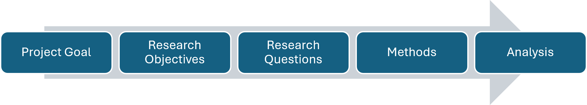

# Table of Contents

[Chapter 1 - Writing Through the IQP Process
[9](#chapter-1---writing-through-the-iqp-process)](#chapter-1---writing-through-the-iqp-process)

[1.1 From Proposal to Final Report
[9](#from-proposal-to-final-report)](#from-proposal-to-final-report)

[Research Proposal [9](#research-proposal)](#research-proposal)

[IQP Final Report [9](#iqp-final-report)](#iqp-final-report)

[1.2 Writing Is Part of the Research Process
[9](#writing-is-part-of-the-research-process)](#writing-is-part-of-the-research-process)

[1.3 Writing as a Team [10](#writing-as-a-team)](#writing-as-a-team)

[1.4 How to Use This Guide
[11](#how-to-use-this-guide)](#how-to-use-this-guide)

[1.5 Planning Your Next Steps
[11](#planning-your-next-steps)](#planning-your-next-steps)

[Chapter 2 - Building Your Research Story
[12](#chapter-2---building-your-research-story)](#chapter-2---building-your-research-story)

[2.1 Introduction [12](#introduction)](#introduction)

[What is the purpose of the introduction?
[12](#what-is-the-purpose-of-the-introduction)](#what-is-the-purpose-of-the-introduction)

[Writing Your Proposal Introduction
[13](#writing-your-proposal-introduction)](#writing-your-proposal-introduction)

[Writing Your Final Report Introduction
[13](#writing-your-final-report-introduction)](#writing-your-final-report-introduction)

[Planning Your Next Steps
[13](#planning-your-next-steps-1)](#planning-your-next-steps-1)

[2.2 Background Chapter [15](#background-chapter)](#background-chapter)

[What is the purpose of the Background Chapter?
[15](#what-is-the-purpose-of-the-background-chapter)](#what-is-the-purpose-of-the-background-chapter)

[Researching for your Background Chapter
[15](#researching-for-your-background-chapter)](#researching-for-your-background-chapter)

[Synthesizing Your Research
[16](#synthesizing-your-research)](#synthesizing-your-research)

[Organizing Your Background
[16](#organizing-your-background)](#organizing-your-background)

[Related Guidance [18](#related-guidance)](#related-guidance)

[Writing Your Proposal Background
[19](#writing-your-proposal-background)](#writing-your-proposal-background)

[Writing Your Final Report Background
[19](#writing-your-final-report-background)](#writing-your-final-report-background)

[Planning Your Next Steps
[19](#planning-your-next-steps-2)](#planning-your-next-steps-2)

[2.3 Methods Chapter [20](#methods-chapter)](#methods-chapter)

[What is the purpose of the Methods Chapter?
[20](#what-is-the-purpose-of-the-methods-chapter)](#what-is-the-purpose-of-the-methods-chapter)

[Developing Your Research Design
[21](#developing-your-research-design)](#developing-your-research-design)

[Project Goal [21](#project-goal)](#project-goal)

[Research Objectives [21](#research-objectives)](#research-objectives)

[Research Questions [22](#research-questions)](#research-questions)

[Choosing Your Methods
[22](#choosing-your-methods)](#choosing-your-methods)

[Connect Research Questions to Methods
[23](#connect-research-questions-to-methods)](#connect-research-questions-to-methods)

[Planning for Data Analysis
[24](#planning-for-data-analysis)](#planning-for-data-analysis)

[Triangulating Your Research
[25](#triangulating-your-research)](#triangulating-your-research)

[Considering Research Limitations
[26](#considering-research-limitations)](#considering-research-limitations)

[Research Ethics and the IRB
[27](#research-ethics-and-the-irb)](#research-ethics-and-the-irb)

[Write Your Methods in Active Voice
[29](#write-your-methods-in-active-voice)](#write-your-methods-in-active-voice)

[Writing Your Proposal Methods
[30](#writing-your-proposal-methods)](#writing-your-proposal-methods)

[Writing Your Final Report Methods
[30](#writing-your-final-report-methods)](#writing-your-final-report-methods)

[Organizing and Writing Your Methods Chapter
[31](#organizing-and-writing-your-methods-chapter)](#organizing-and-writing-your-methods-chapter)

[Related Guidance [34](#related-guidance-1)](#related-guidance-1)

[Chapter 3 - Making Sense of and Communicating What You Learned
[35](#_Toc242037540)](#_Toc242037540)

[3.1 Findings [35](#findings)](#findings)

[What is the purpose of the Findings Chapter?
[35](#what-is-the-purpose-of-the-findings-chapter)](#what-is-the-purpose-of-the-findings-chapter)

[Data Are Not Findings
[35](#data-are-not-findings)](#data-are-not-findings)

[Moving from Analysis to Findings
[35](#moving-from-analysis-to-findings)](#moving-from-analysis-to-findings)

[Findings Are Not Always Problems
[36](#findings-are-not-always-problems)](#findings-are-not-always-problems)

[Organizing Your Findings
[36](#organizing-your-findings)](#organizing-your-findings)

[State the Finding, Then Support It
[37](#state-the-finding-then-support-it)](#state-the-finding-then-support-it)

[Use Evidence Selectively
[37](#use-evidence-selectively)](#use-evidence-selectively)

[Triangulate Your Evidence
[38](#triangulate-your-evidence)](#triangulate-your-evidence)

[Acknowledge Limitations and Alternative Interpretations
[38](#acknowledge-limitations-and-alternative-interpretations)](#acknowledge-limitations-and-alternative-interpretations)

[Background, Methods, or Findings?
[38](#background-methods-or-findings)](#background-methods-or-findings)

[Planning Your Findings Chapter
[39](#planning-your-findings-chapter)](#planning-your-findings-chapter)

[3.2 Recommendations [40](#recommendations)](#recommendations)

[What is the purpose of the Recommendations Chapter?
[40](#what-is-the-purpose-of-the-recommendations-chapter)](#what-is-the-purpose-of-the-recommendations-chapter)

[State Recommendations Directly
[40](#state-recommendations-directly)](#state-recommendations-directly)

[Make the Audience Clear
[41](#make-the-audience-clear)](#make-the-audience-clear)

[Connect Recommendations to Evidence
[41](#connect-recommendations-to-evidence)](#connect-recommendations-to-evidence)

[Provide a Path Toward Implementation
[41](#provide-a-path-toward-implementation)](#provide-a-path-toward-implementation)

[Prioritize When Appropriate
[42](#prioritize-when-appropriate)](#prioritize-when-appropriate)

[Recommendations for Future Research
[42](#recommendations-for-future-research)](#recommendations-for-future-research)

[Planning Your Recommendations
[43](#planning-your-recommendations)](#planning-your-recommendations)

[3.3 Conclusion [43](#conclusion)](#conclusion)

[What is the purpose of the Conclusion?
[43](#what-is-the-purpose-of-the-conclusion)](#what-is-the-purpose-of-the-conclusion)

[Move from the Project to Its Larger Significance
[43](#move-from-the-project-to-its-larger-significance)](#move-from-the-project-to-its-larger-significance)

[Keep the Conclusion Meaningful
[44](#keep-the-conclusion-meaningful)](#keep-the-conclusion-meaningful)

[Chapter 4 - Completing the Proposal and Final Report
[45](#chapter-4---completing-the-proposal-and-final-report)](#chapter-4---completing-the-proposal-and-final-report)

[4.1 What Goes in Each Document?
[45](#what-goes-in-each-document)](#what-goes-in-each-document)

[4.2 Completing Your ID2050 Research Proposal
[47](#completing-your-id2050-research-proposal)](#completing-your-id2050-research-proposal)

[Proposal Conclusion [47](#proposal-conclusion)](#proposal-conclusion)

[Proposal Front Matter
[47](#proposal-front-matter)](#proposal-front-matter)

[Title Page [47](#title-page)](#title-page)

[Authorship Table [48](#authorship-table)](#authorship-table)

[AI Use Statement [48](#ai-use-statement)](#ai-use-statement)

[Table of Contents, List of Figures, and List of Tables
[49](#table-of-contents-list-of-figures-and-list-of-tables)](#table-of-contents-list-of-figures-and-list-of-tables)

[References [49](#references)](#references)

[Proposal Appendices [49](#proposal-appendices)](#proposal-appendices)

[Assembling Your ID2050 Research Proposal
[50](#assembling-your-id2050-research-proposal)](#assembling-your-id2050-research-proposal)

[Related Guidance [51](#_Toc242037578)](#_Toc242037578)

[4.3 Completing Your IQP Final Report
[51](#completing-your-iqp-final-report)](#completing-your-iqp-final-report)

[Final Report Front Matter
[51](#final-report-front-matter)](#final-report-front-matter)

[Cover Page and Title Page
[51](#cover-page-and-title-page)](#cover-page-and-title-page)

[Abstract [52](#abstract)](#abstract)

[Acknowledgments [54](#acknowledgments)](#acknowledgments)

[Meet the Team [54](#meet-the-team)](#meet-the-team)

[Authorship Statement
[54](#authorship-statement)](#authorship-statement)

[AI Use Statement [54](#ai-use-statement-1)](#ai-use-statement-1)

[Table of Contents, List of Figures, and List of Tables
[54](#table-of-contents-list-of-figures-and-list-of-tables-1)](#table-of-contents-list-of-figures-and-list-of-tables-1)

[References [55](#references-1)](#references-1)

[Appendices and Supplemental Materials
[55](#appendices-and-supplemental-materials)](#appendices-and-supplemental-materials)

[Assembling Your IQP Final Report
[56](#assembling-your-iqp-final-report)](#assembling-your-iqp-final-report)

[Related Guidance [56](#related-guidance-2)](#related-guidance-2)

[Chapter 5 - Documenting Your Project and Designing Your Report
[58](#chapter-5---documenting-your-project-and-designing-your-report)](#chapter-5---documenting-your-project-and-designing-your-report)

[5.1 Designing for Your Reader
[58](#designing-for-your-reader)](#designing-for-your-reader)

[5.2 Figures, Tables, and Data Visualization
[61](#figures-tables-and-data-visualization)](#figures-tables-and-data-visualization)

[5.3 Formatting and Document Mechanics
[63](#formatting-and-document-mechanics)](#formatting-and-document-mechanics)

[5.4 Citations and References
[66](#citations-and-references)](#citations-and-references)

[5.5 Editing and Proofreading Your Report
[69](#editing-and-proofreading-your-report)](#editing-and-proofreading-your-report)

[5.6 Final Document Checklist
[70](#final-document-checklist)](#final-document-checklist)

[Chapter 6 - Sharing and Extending Your Project
[73](#chapter-6---sharing-and-extending-your-project)](#chapter-6---sharing-and-extending-your-project)

[6.1 Submitting Your Final Report to e-Projects
[73](#submitting-your-final-report-to-e-projects)](#submitting-your-final-report-to-e-projects)

[6.2 Printing Your Final Report
[73](#printing-your-final-report)](#printing-your-final-report)

[6.3 Project Recognition Opportunities
[73](#project-recognition-opportunities)](#project-recognition-opportunities)

[WPI President's IQP Awards Recognition
[73](#wpi-presidents-iqp-awards-recognition)](#wpi-presidents-iqp-awards-recognition)

[The Forum on Education Abroad: Award for Academic Achievement Abroad
[73](#the-forum-on-education-abroad-award-for-academic-achievement-abroad)](#the-forum-on-education-abroad-award-for-academic-achievement-abroad)

[Harvard Scholarship & Social Justice Undergraduate Research Conference
[74](#harvard-scholarship-social-justice-undergraduate-research-conference)](#harvard-scholarship-social-justice-undergraduate-research-conference)

[WPI Annual Sustainability Project Competition
[74](#wpi-annual-sustainability-project-competition)](#wpi-annual-sustainability-project-competition)

[6.4 Publication Opportunities
[74](#publication-opportunities)](#publication-opportunities)

[Undergraduate Journal of Service Learning & Community-Based Research
[74](#undergraduate-journal-of-service-learning-community-based-research)](#undergraduate-journal-of-service-learning-community-based-research)

[Resources [75](#resources)](#resources)

[Design Resources [75](#design-resources)](#design-resources)

[Examples of Exceptional Reports
[75](#examples-of-exceptional-reports)](#examples-of-exceptional-reports)

[Examples of Exceptional Findings and Recommendations Chapters
[75](#examples-of-exceptional-findings-and-recommendations-chapters)](#examples-of-exceptional-findings-and-recommendations-chapters)

[APA and Citation Resources
[75](#apa-and-citation-resources)](#apa-and-citation-resources)

[Appendix A: Cover Page Examples
[76](#appendix-a-cover-page-examples)](#appendix-a-cover-page-examples)

[Appendix B: Required WPI Title Page for Final Report
[77](#appendix-b-required-wpi-title-page-for-final-report)](#appendix-b-required-wpi-title-page-for-final-report)

[Appendix C: Example Final Report Authorship
[78](#appendix-c-example-final-report-authorship)](#appendix-c-example-final-report-authorship)

[Appendix D: Example Meet the Team Pages
[79](#appendix-d-example-meet-the-team-pages)](#appendix-d-example-meet-the-team-pages)

[
[79](#p128yis2graphical-user-interface-website-description-automatically-generated)](#p128yis2graphical-user-interface-website-description-automatically-generated)

# Chapter 1 - Writing Through the IQP Process

## 1.1 From Proposal to Final Report

The research proposal you develop in ID2050 and the final report you
complete at the end of your Interactive Qualifying Project (IQP) are
connected pieces of the same research process. They serve different
purposes and are written at different points in the project, but the
thinking and writing you do for one provides the foundation for the
next.

### Research Proposal

During ID2050, your team is preparing to conduct a research project with
your host organization. You are learning about the project and its
context, considering the perspectives of your project host and other
stakeholders, identifying what you know and what you still need to
learn, and developing a research approach that will allow you to
successfully complete your project. Your research proposal captures your
team's best understanding and plan at the start of your IQP.

### IQP Final Report

During your IQP, you put the plan from your proposal into practice. You
work with your host organization and local community, collect and
analyze information, encounter unexpected challenges, and develop a
deeper understanding of the project. Your final report communicates what
you actually did, what you learned, and what you recommend based on the
evidence you collected.

<table style="width:92%;">
<colgroup>
<col style="width: 46%" />
<col style="width: 46%" />
</colgroup>
<thead>
<tr>
<th><strong>ID2050 and the Proposal</strong></th>
<th><strong>IQP Final Report</strong></th>
</tr>
</thead>
<tbody>
<tr>
<td>What do we understand now? 
What do we need to learn? 
How do we plan to learn it?</td>
<td>What did we do? 
What did we learn? 
What can we reasonably conclude? 
What do we recommend?</td>
</tr>
</tbody>
</table>

The proposal gives you a strong plan to begin your IQP, but you should
expect that your plan will change as you begin your project. Research
rarely unfolds exactly as planned, particularly when you are working on
complex problems with organizations and communities. This does not mean
that your proposal was wrong. The proposal was your best plan for how to
approach your project given the information you had at the time.

## 1.2 Writing Is Part of the Research Process

It can be tempting to think of the proposal as something you write at
the beginning of the project and the final report as a product that you
create at the end. In truth, the proposal should guide your team
throughout the entire research project, and the final report should be
something you develop throughout the project term.

When your team tries to explain why a problem matters, you may discover
that you do not yet understand part of the context and you need to
conduct additional background research. When you try to write a research
question, you may realize it is too broad to answer, and you need to
narrow the scope of your project. When you use a particular method in
the field, you may realize it will not provide the information you need,
and you may need to adjust your approach. When you try to explain a
finding, you may discover that you do not have enough evidence to
support your conclusions.

This is all part of the research process, and it is also why the final
report is not simply your proposal with the verbs changed from future to
past tense.

Throughout the project term, you will return to writing you have already
done and ask whether it still represents your project. Sometimes you
will make relatively small revisions. Other times you may need to
rethink a section because the direction of the project or your
understanding of the project has changed.

This guide will help you to draft your initial proposal and to
critically evaluate and revise it as you work to complete your final
report.

## 1.3 Writing as a Team

Your proposal and final report are team documents. That does not mean
every sentence needs to be written by every team member, nor does it
mean the most efficient way to write is to sit together and compose
every paragraph collectively.

It makes sense that your team will divide some of the initial research
and drafting. But dividing the writing is not the same as dividing
responsibility for the report.

Everyone on the team should understand the argument the report is
making, the research methods you are using, the evidence you collected,
and the conclusions and recommendations you make.

This means that team writing requires more than combining independently
written sections into one document. As you revise together, pay
attention to:

- whether sections make the same assumptions;

- whether you are using important terms consistently;

- whether ideas build logically from one section to another;

- whether there is repetition because everyone is explaining the same
  concepts in multiple places;

- whether there are gaps because everyone thought someone else was
  explaining something;

- whether the document sounds like one team telling one coherent
  research story.

## 1.4 How to Use This Guide

You do not need to read this guide from beginning to end every time you
work on your report. Think of it as a working guide that your team will
return to throughout ID2050 and your IQP.

Each major section of the guide begins by explaining what that part of
the report is trying to accomplish. From there, the guide will help you
develop that section for your proposal and, where appropriate, return to
it during IQP to transform it into your final report.

I have structured this guide to include three recurring elements:

**Writing Your Proposal**

These sections focus on the decisions your team needs to make while
developing your research proposal in ID2050. At this stage, you are
explaining what you understand, what you need to learn, and what you
plan to do.

**Writing Your Final Report**

These sections ask you to return to your earlier work after you have
conducted the research. The goal is not simply to update what you wrote.
Consider what you now know, what has changed, and what your final report
needs to include.

**Planning Your Next Steps**

These are questions for your team to work through together. They are not
a checklist or another assignment. Some will help you get started.
Others will help you make decisions while you are writing or determine
how your thinking needs to change as you move from proposal to final
report.

## 1.5 Planning Your Next Steps

As you begin working on your project, use these questions to identify
what your team understands, what you still need to figure out, and how
you will approach the work together. Before you move on to the next
section, consider these questions as a team:

1.  What do we currently understand about our project, and what are we
    still trying to understand?

2.  Who will need to read and use our work, both during ID2050 and
    during the IQP?

3.  What does our project host need from this project? Are there other
    stakeholders who may need something different?

4.  How will we work as a team so that our proposal and final report
    represent shared thinking rather than separate pieces written by
    different people?

# Chapter 2 - Building Your Research Story

Your ID 2050 research proposal has three main chapters: **Introduction,
Background, and Methods**. Together, these chapters tell the story of
your project and your plan for how you will conduct your research.
During your IQP, you will revise these chapters as your project develops
to add additional background context, document your actual research
process, and ensure your final report accurately represents the project
you completed.

# 2.1 Introduction

### What is the purpose of the introduction?

The Introduction gives readers their first understanding of your
project. It should help them understand the larger societal context, the
specific problem or opportunity your project addresses, why the project
is needed, and what your team will do about it.

For most projects, this can be accomplished in about five paragraphs,
although some projects will need more. Rather than focusing on the
number of paragraphs, think about the five moves your Introduction needs
to make.

**Move 1: Establish the Broader Context**

Begin with the larger societal context connected to your project. What
is happening in the world, country, region, field, or community that
makes this project important? Use research or evidence where appropriate
to help readers understand the significance of the issue.

**Move 2: Identify the Local Problem or Opportunity**

Narrow the focus to the specific problem, need, or opportunity your
project addresses. What does the larger issue look like in your local
context? Who is affected? This is often where you will briefly introduce
your project host and their connection to the issue.

**Move 3: Explain What Is Already Known or Being Done**

Briefly establish what is already known about the problem and what has
already been done to address it. This might include previous research,
programs, policies, practices, or approaches. You will develop these
ideas more fully in your Background. Here, include what your reader
needs to understand the current situation.

**Move 4: Identify What Still Needs to Be Understood or Addressed**

Given what is already known or being done, what is still missing,
unresolved, or not working well enough? For an IQP, this does not have
to be a gap in academic research. It may be a practical gap in
knowledge, understanding, practice, or capacity. This is what creates
the need for your project.

**Move 5: Introduce Your Project and Its Purpose**

Finally, explain how your project responds to that need. Introduce your
project goal and the major objectives that will guide your work. You do
not need to explain the details of your research methods here. Your
reader simply needs to understand what your team is trying to accomplish
and how it connects to the problem you have established.

Together, the five moves should create a logical progression. You will
end the Introduction with a brief roadmap that helps readers understand
where the report will go next.

### Writing Your Proposal Introduction

Your proposal Introduction represents your team's best understanding of
the project during ID2050. You may understand some parts of the project
before others, so expect to return to the Introduction as you conduct
more background research, talk with your project host, and refine your
project goal and objectives. By the end of the Introduction, your reader
should understand why the project is needed and what your team plans to
accomplish.

### Writing Your Final Report Introduction

When you return to the Introduction during IQP, do not simply change the
verbs from future to past tense. Return to the five moves and ask
whether they still tell the right story. Your understanding of the
context, problem, stakeholders, or project itself may have changed.
Revise the Introduction to reflect what you understand now and the
project you completed.

Pay particular attention to Moves 4 and 5. Does the need you identified
in the proposal still make sense based on what you learned? Does your
project goal accurately represent the work you ultimately completed?
Update the roadmap as well so that it reflects the organization of your
final report.

### Planning Your Next Steps

Use the five moves to sketch the structure of your Introduction before
you begin drafting. You do not need complete sentences. Jot down the
main ideas, evidence you might use, and anything your team still needs
to figure out.

| **Introduction Move and Questions to Guide Your Planning** | **Your Ideas** |
|----|----|
| **1. Broader Context:** What larger societal context does our reader need to understand? Why does it matter? What evidence or information might help establish its importance? |  |
| **2. Local Problem or Opportunity:** What is the specific problem, need, or opportunity our project addresses? What does our reader need to know about the local context and our project host's connection to the issue? |  |
| **3. What Is Already Known or Being Done:** What does our reader need to know about what has already been learned, tried, or done? What research, programs, policies, practices, or other approaches are most relevant? |  |
| **4. What Still Needs to Be Understood or Addressed:** What is still missing, unresolved, unknown, or not working well enough? What does our project host or community still need to know, understand, develop, evaluate, or address? |  |
| **5. Our Project:** How does our project respond to the need we identified? What are we trying to accomplish? What is our project goal? What are our major objectives? |  |
| **Look at the Introduction as a Whole:** Can we trace a clear path from the larger issue to the need for our project? Where does the story make a jump? What do we still need to research, discuss, or figure out? |  |

## 2.2 Background Chapter

### What is the purpose of the Background Chapter?

The Background Chapter provides the research and context needed to
understand your project. Depending on the project, this may include
research about the larger issue, the local context, important
stakeholders and their perspectives, previous efforts to address the
problem, and approaches used in other places or contexts.

You may also hear this chapter referred to as a literature review. In
this guide, I use the term *Background*, but you can think of
*Background* and *literature review* as referring to the same general
part of your research report. In both cases, the goal is to bring
together and synthesize existing research and knowledge related to your
project.

The purpose of the Background can change as you move from your ID2050
proposal to your final report. During ID2050, the process of researching
the Background is an important part of how your team prepares for the
project. You will likely begin with limited knowledge about the topic,
local context, stakeholders, or approaches others have used to address
similar problems. Background research helps your team come up to speed
on the project and develop the knowledge you need to make informed
decisions about your research. You then use what you have learned to
write a formal Background chapter.

By the time you write your final report, you have developed a much
deeper understanding of the project and the purpose of the Background
shifts toward your reader. In your final report, your Background will
provide readers with the context they need to understand your project,
research, findings, and recommendations. This is why you will revisit
and revise your Background during your IQP term.

**Purpose of the Background Chapter**

| **ID2050 Proposal** | **IQP Final Report** |
|----|----|
| Help your team come up to speed on the topic and develop the knowledge needed to plan and conduct your research. | Help your reader understand the context and existing knowledge needed to make sense of the project and the research you completed. |

### Researching for your Background Chapter

Developing your Background is an iterative process. You will not know
everything you need to research at the beginning, and you do not need to
finish your research before you start writing. What you learn will lead
to new questions, and writing will often help you identify gaps in your
understanding.

**The Research and Writing Process**

As you work through this process, look for patterns, different
perspectives, areas of agreement and disagreement, previous approaches,
and questions that remain unresolved. The goal is to move from
collecting information to making sense of what you are learning. You
will probably move back and forth among these steps rather than
following them once in order. That is part of the research and writing
process.

### Synthesizing Your Research

A strong Background is organized around ideas rather than individual
sources. Your sources provide evidence for the ideas you are developing,
but the sources themselves should not determine the organization of the
chapter. As you write, look across your research. *Where do sources
agree or disagree? What patterns emerge? What different perspectives are
represented? What does the research collectively help you understand
about the issue?*

Instead of writing a paragraph about one source followed by a paragraph
about another, bring information from multiple sources together to
develop the ideas your reader needs to understand.

The goal is to move from reporting what individual sources say to
synthesizing what the research helps us understand about the issue.

### Organizing Your Background

There is no single correct
way to organize a Background chapter. Choosing the structure is one of
the important decisions your team will make. Think about the story your
Background needs to tell. *What does your reader need to understand
first? What information builds on that understanding? How should the
chapter eventually lead toward the research your team will conduct?*

The following structures are useful starting points, but they are not
required formats.

#### The Funnel

A funnel moves from the broader issue toward the specific context of
your project. A funnel works well when your reader first needs to
understand a larger issue before they can understand the specific local
problem. The important question is not simply whether you can move from
broad to narrow.

Ask:

*Does understanding each section help the reader understand why the next
section matters?*

#### The Sandwich

Sometimes readers need to understand the local context before the
broader research will make sense. In this case, a sandwich structure may
work better.

The community and its current waste-management challenge\
↓\
Research on household waste behaviors\
↓\
Approaches used in other communities\
↓\
What is known about participation and behavior change\
↓\
What this research suggests for the local project

Here, you begin with the specific local context, step back to consider
broader research and examples, and then return to the project context
with a stronger understanding of it. A sandwich structure can be useful
when the project is strongly grounded in a particular place,
organization, or community and readers need that context to understand
why the broader research is relevant.

#### A Thematic Structure

For some projects, there is no obvious broad-to-narrow sequence.
Instead, readers may need to understand several connected dimensions of
a problem.

A thematic structure can work well when several related issues or
perspectives need to be understood together.

#### Other Organization Options

Funnel, sandwich, and thematic are potential structures and not firm
rules for how to organize your background chapter. Your project may need
a variation, a combination of these approaches, or a different structure
entirely. Whatever approach you choose, your team should be able to
explain the logic behind the flow, and you should ensure that your
writing includes transitions that help the reader understand the
connection as you move from one section to the next.

You can use descriptive section headings to help make that structure
visible. Your headings should tell readers something about the ideas in
the section rather than simply label broad categories such as *Previous
Research* or *Project Host*. The Background should ultimately bring your
reader to the point where your own research follows logically from what
is already known and what still needs to be understood.

### Related Guidance

Several other parts of this guide address research and writing skills
that you will use when developing your Background. You can refer to
these sections as needed when you are writing your background chapter.

- Quoting, Paraphrasing, and Summarizing: Section 5.4

- Citations and References: Section 5.4

- Using AI in Research and Writing: Section 5.4

### Writing Your Proposal Background

The background chapter in your proposal represents what your team
understands before beginning your IQP. The process of conducting
background research should help you come up to speed on the major issues
surrounding your project and make informed decisions about the research
you plan to conduct. By the end of ID2050, your Background should
formally synthesize what your team has learned and provide a strong
foundation for your proposed research.

### Writing Your Final Report Background

Your proposal Background gives you a strong starting point for the final
report, but it will need to be revisited and revised before you can
include it in your final report. The purpose of your background in your
final report is to provide your reader with enough context to understand
the project you completed. To revise your background chapter, you may
need to:

- Keep material your readers still need to understand the project.

- Add research or context you learned during IQP.

- Remove information your team needed to learn in ID2050 but your reader
  does not need.

- Revise explanations you now understand differently.

- Reorganize the chapter if the original structure no longer fits the
  completed project.

Your final Background Chapter should represent what your team
understands about the project now, not simply what you knew when you
wrote the proposal. As you revise, also pay attention to the difference
between Background and Findings. Both may contain information that helps
readers understand your project, but the key difference is often where
the knowledge came from. The background draws primarily on knowledge
that already existed, while findings present knowledge your team
generated through your research.

|  | **Background** | **Findings** |
|----|----|----|
| **Where does the knowledge come from?** | Existing research, reports, documents, and other knowledge produced by others | Evidence your team collected and analyzed through your project research |
| **Why is it included?** | To give readers the context and existing knowledge they need to understand the project | To show what your research helped you learn and how it answers your research questions |

### Planning Your Next Steps

Before you begin drafting your Background, your team needs to decide how
you will organize the chapter. Take a step back from the individual
sources and topics you have been researching and think about the story
your Background needs to tell. Use these questions to plan the
organization of your chapter:

1.  What are the major ideas your reader needs to understand?

2.  How are those ideas connected?

3.  What does your reader need to understand first for the later
    sections to make sense?

4.  Which ideas belong together in the same section?

5.  Would a funnel, sandwich, thematic, or another structure work best
    for your project?

6.  Where should the Background leave the reader so that your own
    research follows logically?

Then sketch a possible outline for your chapter. Focus first on the
ideas and the order in which your reader needs to encounter them. Don't
worry about perfect section headings yet. Your outline can continue to
change as your team's understanding develops.

| Background Section | What is the purpose of this section? | Why does this section appear in this order? |
|----|----|----|
| Beginning: |  |  |
| Next: |  |  |
| Next: |  |  |
| Next: |  |  |
| Leading to our research: |  |  |

# 2.3 Methods Chapter

### What is the purpose of the Methods Chapter?

The Methods Chapter explains how your team will conduct, or conducted,
the research needed to accomplish your project goal. It connects what
you are trying to accomplish with what you need to learn and the methods
you will use to learn it. Think of your Methods Chapter as an
instruction manual for your research. In your ID2050 proposal, it
provides the plan your team will use to guide your research during IQP.
In your final report, it documents what you actually did in enough
detail that another researcher could understand and repeat your
approach.

A strong Methods Chapter explains three things throughout:

***WHAT you want to learn.***

***HOW you will learn it.***

***WHY this approach makes sense.***

In your proposal, the Methods Chapter is your research plan. In your
final report, it records the research you actually conducted.

|  | **ID2050 Proposal** | **IQP Final Report** |
|----|----|----|
| Purpose of the Methods Chapter | Provide a detailed research plan that will guide your team's work during IQP. | Document what your team actually did and how you did it so readers can understand, evaluate, and potentially repeat your research. |

### Developing Your Research Design

A strong Methods Chapter begins before you select your methods. It can
be tempting to begin by saying, "we will conduct interviews" or "we will
create a survey." But selecting a method should not be the first step.
First decide <u>what you are trying to accomplish</u> and <u>what you
need to learn</u>. Then decide the methods you will use to learn it.

Your research design should create a logical connection between your:

Each part should help you make decisions about the next.

### Project Goal

Your project goal describes what your team ultimately hopes to
accomplish through the project. It should respond to the problem or
opportunity you established in your Introduction and Background. Your
goal tells us where the project is going. It should be broad enough to
capture the overall purpose of your project but specific enough that
your team can realistically accomplish it during your IQP. A goal might
generally take this form: **To <u>*\[accomplish something\]*</u>
for/with *<u>\[project host or community\]</u>* in order to *<u>\[larger
purpose\]. </u>***The exact wording will depend on your project.

### Research Objectives

Your research objectives identify the major areas your team needs to
investigate or understand in order to accomplish your project goal.
Objectives should focus on what you need to learn, understand, assess,
evaluate, explore, or determine, rather than simply listing the
activities you plan to complete.

For example:

Objective: ***Understand residents' current transportation behaviors and
barriers to using public transit.*** (This is something you need to
learn in order to accomplish your goal.)

is different from: *Conduct interviews with residents.* (Conducting
interviews is a <u>method</u> your team might use to accomplish the
objective.)

It is also different from: *Develop a transportation guide.*(This might
be a <u>deliverable</u> produced as a result of the project.)

Keeping these distinctions clear will help you develop a research plan
in which every activity has a purpose.

### Research Questions

Research questions make your objectives more specific. They identify the
questions your team needs to answer in order to accomplish each
objective.

For example:

Objective: ***Understand residents' current transportation behaviors and
barriers to using public transit.***

Possible research questions might include:

- *How do residents currently travel?*

- *What barriers prevent residents from using public transit?*

- *Do those barriers differ among stakeholder groups?*

Research questions should be specific enough that you can begin asking:
*What information would allow us to answer this question?* That question
provides the bridge between your research questions and your methods.

#### Start Planning Your Research Goal, Objectives, and Research Questions

Before deciding which methods to use, take some time with your team to
complete the table below, working from your project goal toward the
information you need and where or from whom you might obtain that
information.

<table>
<colgroup>
<col style="width: 12%" />
<col style="width: 18%" />
<col style="width: 19%" />
<col style="width: 26%" />
<col style="width: 22%" />
</colgroup>
<thead>
<tr>
<th>Project Goal</th>
<th>Research Objective</th>
<th>Research Questions</th>
<th>What information do we need?</th>
<th>Who or what can provide it?</th>
</tr>
</thead>
<tbody>
<tr>
<td rowspan="5"></td>
<td>1.</td>
<td></td>
<td></td>
<td></td>
</tr>
<tr>
<td>2.</td>
<td></td>
<td></td>
<td></td>
</tr>
<tr>
<td>3.</td>
<td></td>
<td></td>
<td></td>
</tr>
<tr>
<td></td>
<td></td>
<td></td>
<td></td>
</tr>
<tr>
<td></td>
<td></td>
<td></td>
<td></td>
</tr>
</tbody>
</table>

Look across your plan before moving on to methods.

- *Does each objective help you accomplish your project goal?*

- *Do your research questions help you accomplish the objective?*

- *Do you know what information you would need to answer each question?*

- *Are any of your objectives actually methods, activities, or
  deliverables?*

Once you know what you need to learn and what information you need, you
are ready to decide what methods you will use to collect it.

### Choosing Your Methods

A research method is the approach you use to collect the information
needed to answer your research questions. Depending on your project,
your methods might include interviews, surveys, focus groups,
observation, archival research, comparative analysis, or other
approaches appropriate to your research questions. Your project should
use multiple methods. Different methods can help you answer different
questions, gather information from different sources, or provide
different perspectives on the same issue.

Selecting a method is only the beginning. Your Methods Chapter needs to
explain what you will do, how you will do it, and why that approach
makes sense.

**WHAT will you do?**

Explain the method and what you hope to learn from it. Be specific about
the information you are trying to collect and its relationship to your
research question or objective.

**HOW will you do it?**

Explain how you will actually implement the method. Depending on the
method, this may include:

- who will participate in the research;

- how participants, locations, documents, or other sources will be
  selected;

- how participants will be recruited;

- where or how the research will take place;

- what questions, protocols, instruments, or measurements you will use;

- how much information you intend to collect;

- how you will record, organize, and manage the information; and

- how you will analyze the information once it is collected.

The details will be different for different methods. Interviews will
require different information than observations, surveys, or archival
research.

**WHY is this the right approach?**

Do not assume that the reason for choosing a particular method will be
obvious to your reader. Explain why the method is appropriate for the
information you need and the context in which you will be working.
Consider:

- Why will this method help answer your research question?

- Why are these participants, locations, documents, or other sources
  appropriate?

- Why are you collecting the information you propose?

- Have other researchers successfully used a similar approach? When
  useful, cite methodological guidance or previous studies to support
  your research choices.

- Are there characteristics of the local context or population that
  influenced your decision?

- What are the strengths and limitations of the method?

Your justification should show that the method is an intentional
research decision rather than simply a convenient activity.

### Connect Research Questions to Methods

Use your research questions to work through the major decisions for each
method before you begin writing the chapter.

| Research Question | Information Needed | Source of Information | Method | How will we collect it? | Why does this method make sense? |
|----|----|----|----|----|----|
|  |  |  |  |  |  |
|  |  |  |  |  |  |
|  |  |  |  |  |  |
|  |  |  |  |  |  |
|  |  |  |  |  |  |

A method may help answer more than one research question, and you may
use more than one method to answer the same question. What matters is
that you can explain the connection between what you need to learn and
how you plan to learn it.

### Planning for Data Analysis

Your research design should include a plan for how you will make sense
of the information you collect. Collecting data is only the beginning,
you also need to analyze that data to answer your research questions.

During ID2050, you may not yet know exactly how you will analyze your
data. That is okay. Qualitative data analysis is an iterative process,
and your approach will continue to develop as you learn more about data
analysis and begin working with the data you actually collect. At the
proposal stage, however, you should have a reasonable plan for the type
of analysis you expect to use. Depending on your methods and the type of
data you collect, you might:

- code qualitative data from interviews, focus groups, observations, or
  open-ended survey questions to identify patterns and themes;

- summarize survey data using counts, percentages, or comparisons among
  groups;

- organize observational data into categories to identify patterns
  across settings;

- compare programs, policies, technologies, or potential solutions using
  defined criteria; or

Your proposed analysis strategy can be relatively simple, but it should
be specific enough to show that you have thought about how you will turn
the information you collect into evidence that can help answer your
research questions. For qualitative research in particular, analysis is
often iterative. You may begin by coding the data to identify important
or recurring ideas, combine related codes into categories, and
eventually develop larger themes that help answer your research
questions. You do not need to know what those codes or themes will be
before you conduct the research. They will develop as you work with your
data.

#### Data Analysis in Your Final Report

By the time you write your final report, you can be much more specific
about your analysis because you know what data you collected and what
you actually did with it. Return to the analysis plan in your proposal
and replace what you *planned to do* with what you *actually did*.
Depending on your research, this might include explaining:

- how you prepared and organized your data;

- how you developed and applied qualitative codes;

- how codes were combined into categories or themes;

- what quantitative calculations or comparisons you conducted;

- what criteria you used to compare cases, programs, policies, or
  possible solutions;

- how you compared evidence across participants, stakeholder groups, or
  methods; and

- how your analysis helped you answer your research questions.

At the final report stage, students can often be confused about what
aspects of the data analysis belong in the Methods Chapter versus the
Findings Chapter. Remember the Methods Chapter is about what you did.
So, when it comes to data analysis, your Methods Chapter explains how
you analyzed the data (your procedures for analyzing it), and the
Findings Chapter explains what that analysis helped you learn (your
findings).

| **Methods Chapter** | **Findings Chapter** |
|----|----|
| *Your procedures for analyzing data* | *What you learned from your data (your findings!)* |

### Triangulating Your Research

Many IQPs rely on relatively small samples and primarily qualitative
data. One way to strengthen your research is through **triangulation**,
or using multiple methods or sources of evidence to investigate the same
research question. For example, imagine your team is trying to
understand barriers to participation in a community program. You might:

- interview community members about their experiences;

- survey a broader group about common barriers;

- observe how people interact with the program; and

- review participation records or other existing data.

Each method provides a different perspective on the same question. If
your interviews, survey, observations, and existing data point toward
similar conclusions, you have stronger evidence to support a finding. If
they do not agree, that is also important. Differences in the evidence
may reveal something your team needs to investigate further or may
suggest that the situation is more complicated than you initially
thought.

Triangulation does not mean that every research question needs three
methods, or that simply using more methods makes your research stronger.
The goal is to collect different forms of evidence that allow you to
compare, confirm, or complicate what you are learning. As you develop
your research design, ask:

- Which of our research questions would benefit from more than one
  source of evidence?

- Can we investigate the same question using different methods?

- Are we gathering perspectives from different people or stakeholder
  groups?

#### Planning for Triangulation

For research questions where triangulation would strengthen your
research, map out the different evidence you could collect.

| **Research Question** | **Evidence from Method/Source 1** | **Evidence from Method/Source 2** | **Evidence from Method/Source 3** |
|----|----|----|----|
|  |  |  |  |
|  |  |  |  |
|  |  |  |  |

The goal is not to fill every box. Instead, use the table to identify
where multiple forms of evidence could strengthen your ability to answer
an important research question.

### Considering Research Limitations

All research has limitations. A research limitation is something about
your research design, data collection, sample, or analysis that affects
what you can reasonably conclude from your evidence.

#### Limitations in Your Proposal

During ID2050, you will not know all of the limitations your research
will ultimately have. You can, however, anticipate some limitations as
you design your methods. For example, consider:

- Will your sample be relatively small?

- Might it be difficult to reach some groups of participants?

- Are there perspectives your method may not capture?

- Could language or cultural differences affect your research?

- Could the way you ask questions influence the responses you receive?

- Are there practical limitations on how much data you can collect
  during the project term?

Thinking about potential limitations before you begin your research
gives you an opportunity to strengthen your design. You might revise a
data collection tool, change how you recruit participants, or use
another method to triangulate your evidence. In your proposal, you can
discuss anticipated limitations as part of the relevant method and
explain how you plan to address or reduce them when possible.
Alternatively, you could discuss limitations as a subsection of your
Methods Chapter.

#### Limitations in Your Final Report

By the end of your IQP, you will have a much clearer understanding of
your research limitations because you know what actually happened. Some
may be limitations you anticipated. Others may become apparent only
after you collect or analyze your data. For example:

- your sample may be smaller or less representative than you
  anticipated;

- some stakeholder groups may be missing or underrepresented;

- survey or interview questions may have been interpreted differently
  than you intended;

- you may discover that a question was ambiguous or double-barreled;

- you may need to make assumptions when interpreting or categorizing
  some responses;

- one method may provide less useful information than expected; or

- evidence from different methods or stakeholder groups may not agree.

Identifying limitations does not necessarily mean your research is weak.
Limitations help your readers understand the boundaries of your findings
and what you can reasonably claim from your evidence**.** For each
important limitation, consider two questions:

*How did this limitation affect the evidence we collected?*

*What does this mean for the claims we can reasonably make from that
evidence?*

For example, it is not enough to simply state: *Our sample size was
small.* Instead, explain what that limitation means. A small or uneven
sample may provide useful insight into the experiences of the people who
participated while limiting your ability to make claims about a larger
population.

Research limitations do not necessarily need their own section in the
final report. Some limitations fit best in the Methods Chapter, where
you explain how the research was conducted. Others fit better in the
Findings Chapter, where they help readers understand how strongly a
particular finding can be interpreted.

|  | **ID2050 Proposal** | **IQP Final Report** |
|----|----|----|
| **What do you know?** | Limitations you can reasonably anticipate | Limitations you actually encountered |
| **What do you do with them?** | Consider how they could affect the research and ways to reduce or address them | Explain how they affected the evidence and what they mean for interpreting your findings |
| **Where do they go?** | As a subsection in the Methods Chapter or as part of the discussion of the relevant method | With the relevant method and/or finding, depending on what the reader needs to understand |

The goal is not to eliminate every limitation. That is rarely possible.
The goal is to design your research thoughtfully, be transparent about
its limitations, and make claims that are appropriate for the evidence
you collected.

### Research Ethics and the IRB

Research involving human subjects comes with responsibilities to the
people who participate in your study. Ethical research means thinking
carefully about who you ask to participate, what you ask them to do or
share, what risks participation might create, and how you will protect
the information they provide.

These considerations should be part of your research design from the
beginning, not something you think about only when submitting your
Institutional Review Board (IRB) application. The WPI IRB reviews
applicable research involving human participants to help ensure that
participants are appropriately protected and that research complies with
ethical and regulatory requirements. Research requiring IRB review must
receive approval before the research with human participants begins. As
you design your research, consider:

> *Who will participate in the research?*
>
> *What will you ask participants to do or share?*
>
> *Could participating create risks or discomfort?*
>
> *Could participants feel pressured or obligated to participate?*
>
> *Are additional protections needed for vulnerable populations?*
>
> *How will participants decide whether they want to participate?*
>
> *What personal, identifying, or potentially sensitive information will
> you collect?*
>
> *How will you protect participants' privacy and the confidentiality of
> their information?*
>
> *Who will have access to the data?*

*How will participants and their information be represented in your
final report?*

The answers will be different for every project and method. The
important thing is to consider these questions as you develop your
research design.

#### Informed Consent

People who participate in your research should understand what they are
being asked to do and be able to make an informed and voluntary decision
about whether to participate. Your consent process should provide
participants with the information they need to make that decision,
including the purpose of the research, what participation involves,
potential risks, how their information will be used and protected, and
that their participation is voluntary. WPI's informed-consent materials
similarly emphasize explaining the purpose, procedures, foreseeable
risks, and confidentiality of the research so that participants can make
a fully informed decision.

Think about informed consent as more than a form or script you need
before you can collect data. The purpose is to ensure that participants
understand what they are agreeing to before they agree to participate.
Your consent materials should be consistent with the research described
in your Methods Chapter and the questions or activities included in your
data-collection tools.

#### Working with Vulnerable Populations

Some participants or research contexts may require additional
consideration because participants could have greater difficulty freely
deciding whether to participate or could experience greater consequences
from participating. If your research involves a vulnerable population,
think carefully about the risks participation might create, how
participants will be recruited, how consent will be obtained, and
whether additional protections are needed.

The goal is not simply to identify a population as vulnerable. Ask:

*What about this research or research context could create additional
risk for participants, and how can we reduce that risk through our
research design?*

These considerations should influence how you design the method and
should be discussed with your faculty advisors and addressed through the
IRB process as appropriate.

#### Data Management, Privacy, and Confidentiality

Your responsibility to research participants does not end when you
finish an interview, survey, observation, or focus group. Your team also
needs a plan for how you will protect the information participants share
with you. Your data management plan should explain how you will collect,
store, access, use, share, and eventually dispose of your research data.
Depending on your project, consider:

> *What data will you collect?*
>
> *Will you collect names, contact information, demographic information,
> recordings, or other identifying information?*
>
> *Do you need to collect all of that information?*
>
> *Where will the data be stored?*
>
> *Who will have access to the data?*
>
> *Can identifying information be separated from the research data?*
>
> *How will you protect sensitive or confidential information?*
>
> *Will data be shared with your project host or anyone outside the
> research team?*
>
> *How will participants be identified or described when you present
> your findings?*
>
> *What will happen to the data when the project is complete?*

Be careful about the language you use when describing your plans.
Anonymous and confidential are not the same thing. Anonymous data cannot
be connected to an individual participant. Confidential data may be
identifiable to the research team, but the team takes steps to protect
participants' identities and control who can access that information. Do
not promise participants anonymity if you are collecting information
that allows your team to identify them. Instead, be specific about what
information you will collect and how you will protect it.

### Write Your Methods in Active Voice

Write your Methods Chapter primarily in **active voice** so it is clear
who is responsible for each research activity. In most cases, your team
is conducting the research, so say so directly.

For example:

**Active:** We will interview approximately 20 residents to understand
their experiences using public transportation.

rather than:

**Passive:** Approximately 20 residents will be interviewed to
understand their experiences using public transportation.

Active voice makes your research plan clearer and more direct. In your
proposal, use active voice to explain **what your team plans to do**. In
your final report, use it to document **what your team actually did**.
The goal is to avoid hiding who made a decision or conducted an activity
when that information matters.

### Writing Your Proposal Methods

In your proposal, explain how you plan to conduct your research
ethically. The level of detail will depend on your project and the
people involved in your research. Where applicable, your Methods Chapter
should address:

- ethical issues associated with your research participants or context;

- additional protections needed for vulnerable populations;

- how participants will be recruited and informed about the study;

- how you will obtain informed consent;

- how you will protect participants' privacy and confidentiality; and

- how you will manage and protect the data you collect.

Your proposal describes what you intend to do. These plans should be
consistent with your data-collection tools and the materials you submit
for IRB review. Your interview protocols, surveys, consent materials,
recruitment materials, and other data-collection tools generally belong
in your proposal appendices rather than in the body of the Methods
Chapter. The Methods Chapter should explain how those tools fit into
your overall research design.

Your Methods Chapter in your Proposal should also include a timeline
showing how your team plans to carry out the research during IQP. The
timeline should include the major research activities described in your
Methods, such as data collection and analysis, and should show when you
expect them to occur. Depending on your project, it may also include
important project-host meetings, development or testing of project
deliverables, and time for writing and revising the final report.

The goal is not to predict exactly what will happen each week. Research
plans change. Instead, use the timeline to ask whether your research
plan is **realistic within the time available** and whether activities
happen in a logical order. For example, make sure you have allowed
enough time not only to collect your data but also to analyze it and use
what you learn to develop your findings and recommendations.

**Example Project Timeline**

| **Task** | **PQP** | **1** | **2** | **3** | **4** | **5** | **6** | **7** |
|----|----|----|----|----|----|----|----|----|
| Assess Auburn's data and energy needs | X | X | X |  |  |  |  |  |
| Assess level of community support for CAP |  | X | X | X |  |  |  |  |
| Determine an approach to the creation of a Community Action Plan (CAP). | X | X | X | X |  |  |  |  |
| Evaluate the Town of Auburn's resources and search for viable funding sources |  |  | X | X | X |  |  |  |
| Compare Auburn to similar completed CAPs | X | X | X |  |  |  |  |  |
| Create and recommend CAP; seek approval |  |  |  |  | X | X | X | X |

### Writing Your Final Report Methods

In your final report, revise this section to describe what you actually
did to protect research participants and their data. Update your
proposal to reflect the consent procedures, confidentiality protections,
and data-management practices you actually used. If your procedures
changed during the project, the final report should accurately describe
what ultimately occurred.

Include the WPI IRB approval record number for your study in this
section when applicable. Your final Methods Chapter should give readers
enough information to understand how ethical considerations shaped your
research without including participants' confidential or identifying
information.

### Organizing and Writing Your Methods Chapter

Your Methods Chapter should make the logic of your research design
visible. Your reader should be able to understand the connection between
what you are trying to accomplish, what you need to learn, and how you
will collect and analyze the information you need. For many projects,
organizing the chapter around your research objectives works well
because it keeps these connections visible. Within each objective,
describe the methods you will use to answer the related research
questions. If you use more than one method for an objective, give each
method its own subsection.

**A Methods Chapter might be organized something like this:**

1.  Introduction to the Methods Chapter - *Begin with a brief
    introduction that reminds readers of your project goal and research
    objectives and provides an overview of your overall research
    approach. Keep this section relatively short. Its purpose is to
    orient readers to the research design and organization of the
    chapter, not to repeat the Introduction to your report.*

2.  Objective 1: \[Descriptive Objective\] - *Begin by explaining what
    you need to learn to accomplish this objective and identify the
    research questions that will guide this part of your research. Then
    explain each method you will use to answer those questions.*

    1.  Method 1: \[Descriptive Method Heading\] - *For each method,
        explain:*

        - WHAT are you trying to learn and what will you do?

        - HOW will you carry out the method?

        - Who or what will provide the information? How will they be
          selected?

        - What data-collection tools will you use?

        - How will the data be collected and recorded?

        - WHY does this method and approach make sense for answering
          your research questions?

        - Include anticipated limitations or challenges that are
          specific to this method where they are relevant.

    2.  Method 2: \[Descriptive Method Heading\] - *If you use another
        method to address the same objective, follow the same general
        approach. Explain what the method contributes to the objective
        and how it connects to your other methods.*

    3.  When you are using multiple methods to investigate the same
        research question, explain how they will help you triangulate
        your evidence by providing different sources or perspectives
        that can be compared.

3.  Objective 2: \[Descriptive Objective\] *Follow the same logic for
    your next objective:*

    1.  Objective and Research Questions

    2.  Method(s) - WHAT + HOW + WHY

    3.  Continue this structure for additional objectives as needed. Not
        every method has to fit neatly under only one objective. A
        survey, interview, or other method may provide information that
        helps answer questions connected to several objectives. Avoid
        repeating the full description of the method in several places.
        Explain it where it fits best and make the connections to other
        objectives clear.

4.  Data Analysis - *Explain how you plan to make sense of the data you
    collect and how your analysis will help you answer your research
    questions.*

    1.  *In your proposal, you may not yet know every detail of your
        analysis. Your analysis plan can continue to develop as you
        learn more and begin working with your actual data. You should,
        however, describe the general approach you expect to use for
        each type of data.*

    2.  *In your final report, revise this section to explain how you
        actually analyzed your data. Provide enough detail for readers
        to understand how you moved from the information you collected
        to the findings you present later in the report.*

5.  Research Ethics and the IRB - *Explain the ethical considerations
    relevant to your research and how you will protect research
    participants and their data*. Depending on your project, this may
    include:

- working with vulnerable populations;

- recruitment and informed consent;

- privacy and confidentiality; and

- your data-management plan.

  1.  In your proposal, describe what you plan to do.

  2.  In your final report, revise the section to document what you
      actually did and include your IRB approval record number when
      applicable.

6.  Research Limitations - *You do not necessarily need a separate
    Research Limitations section.*

    1.  In your proposal, anticipated limitations that are associated
        with a particular method can usually be discussed as part of
        that method. If there are broader limitations that affect your
        overall research design, you may address those near the end of
        the chapter.

    2.  In your final report, explain the limitations you actually
        encountered where they are most useful to your reader. Some
        belong in the Methods Chapter because they help readers
        understand how the research was conducted. Others may be more
        useful in the Findings Chapter because they affect how a
        particular finding should be interpreted.

    3.  The important thing is not where you put a limitation. It is
        that your reader understands how the limitation affects your
        evidence and what you can reasonably conclude from it.

7.  Timeline for the Project - Include a visual timeline showing the
    major activities needed to carry out your research and complete the
    project during IQP.

#### From Proposal to Final Report

The basic organization of your Methods Chapter may remain similar from
your proposal to your final report, but its purpose and level of detail
will change.

| **Methods Component** | **ID2050 Proposal** | **IQP Final Report** |
|----|----|----|
| Chapter Introduction | State your goal and objectives and preview the research approach you plan to use. | State the goal and objectives that ultimately guided the project and preview the research you actually conducted. |
| Objectives and Research Questions | Explain what you plan to investigate. | Revise them if your project's focus or questions changed so they accurately represent the completed research. |
| Individual Methods | Explain WHAT you plan to do, HOW you plan to do it, and WHY the approach makes sense. Include enough detail for the chapter to guide your team during IQP. | Explain WHAT you actually did, HOW you did it, and WHY. Document important changes so another researcher can understand and, where appropriate, repeat your study. |
| Data Analysis | Describe your current plan for analyzing the different types of data you expect to collect. | Explain how you actually analyzed your data and how you moved from data to findings. |
| Research Ethics and IRB | Explain how you plan to protect participants and their data, including consent, confidentiality, data management, and other relevant ethical considerations. | Document the protections and procedures you actually used and include your IRB approval record number when applicable. |
| Research Limitations | Discuss anticipated limitations with the relevant methods and explain how you plan to reduce or address them when possible. | Explain limitations you actually encountered and what they mean for interpreting your research. Include them with the relevant method and/or finding. |
| Project Timeline | Include a timeline showing when you plan to carry out the major research and project activities during IQP. | Not required. Explain timing or changes in sequence within Methods if they affected how the research was conducted. |
| Data-Collection Tools | Include the complete tools you plan to use, such as interview protocols, surveys, and consent materials, in your appendices. | Include the tools you actually used in your appendices. |

In your proposal, the Methods Chapter should function as an instruction
manual for the research your team plans to conduct. You should be able
to return to it during IQP and understand what you intended to do and
why.

In your final report, the chapter becomes a record of the research you
actually conducted. Do not simply change the verbs in your proposal from
future to past tense. Update participants, sample sizes, procedures,
data-collection tools, analysis, limitations, and other details so that
the chapter accurately represents what happened.

#### Data-Collection Tools and Supporting Materials

Your Methods Chapter should explain your research process, but not every
detail or research tool needs to appear in the body of the chapter.
Materials such as the following generally belong in an appendix or other
supporting section of the report:

- interview and focus group protocols;

- survey instruments;

- observation protocols or checklists;

- recruitment materials;

- consent materials;

- coding guides;

- detailed technical protocols; and

- other research instruments used to collect or analyze data.

The Methods Chapter should explain how and why you used these tools and
how they fit into the research design. The appendix gives readers access
to the actual tool. For example, don't simply write: *See Appendix A for
our interview questions.*

The Methods Chapter should explain who you planned to interview, how
participants were selected, what types of information the interview was
designed to collect, how the interviews would be conducted and recorded,
how responses would be analyzed, and why interviews were appropriate for
the research question. The full interview protocol can then appear in
the appendix.

#### Choosing a Different Organization

Organizing the chapter by objective works well for most projects, but it
is not a required format. Some research designs may be easier to
understand when organized by method or using another structure. Whatever
organization you choose, make the logic of your research easy to follow.
Your reader should be able to trace the connections among your:

If those connections are difficult for your reader to follow, reconsider
the organization of the chapter. The structure should help make your
research design clear, not make the reader work to figure out how the
pieces fit together.

### Related Guidance

Several other parts of this guide address skills and requirements that
you will use when developing and documenting your methodology. Refer to
these sections as needed:

- Citations and References: Section 5.4

- Data Collection Tools and Supporting Materials: Section 5.4

- Appendices and Supplemental Materials: Section 5.4

- WPI Institutional Review Board: [WPI IRB
  website](https://www.wpi.edu/offices/vice-provost-research/compliance/institutional-review-board)

# Chapter 3 - Making Sense of and Communicating What You Learned

Your Introduction, Background, and Methods provide the foundation for
your research. During IQP, you collect and analyze your data and use
that evidence to answer your research questions. Your final report adds
three chapters that communicate what you learned from that research,
what you recommend based on what you learned, and what readers should
ultimately take away from the project.

# 3.1 Findings

## What is the purpose of the Findings Chapter?

The Findings Chapter presents the key discoveries you made through your
research. This is where you answer the important questions that your
Introduction, Background, and Methods have prepared the reader to
understand. Your goal is not simply to tell readers what data you
collected. You will analyze the evidence, identify important patterns
and themes, and explain what your research helped you learn.

### Data Are Not Findings

Be careful not to confuse a piece of data with a finding.

For example: *The average yearly wind speed at the Princeton wind farm
is 13.5 mph.*

is a piece of data.

A finding goes further by explaining what the evidence means: *Expanding
the Princeton wind farm to two 750 kW turbines will pay for itself in
eight years.*

The same distinction applies to qualitative research. A quotation from
an interview participant is evidence and not a finding by itself. Your
findings are the larger idea, pattern, relationship, or theme that you
have drawn from the data and evidence.

### Moving from Analysis to Findings

Your Methods Chapter explains how you analyzed your data. Your Findings
Chapter explains what that analysis helped you learn. As you develop
your findings, return to your research questions and consider:

- What patterns or themes emerged from the data?

- How did different people or stakeholder groups understand the issue?

- What explains why things turned out the way they did?

- What surprised you?

- What appears to be working well, and what evidence supports that
  conclusion?

- Where did evidence from different methods agree?

- Where did it disagree?

- How do your findings confirm, contradict, or add to what you learned
  through your Background research?

- What does your evidence allow you to reasonably claim?

Your findings should be based on the research you conducted, not simply
on what your team believes or expected to find. Do not leave out a
finding simply because it was unexpected or does not fit what your team
anticipated. Unexpected or contradictory evidence may be important to
understanding the project.

### Findings Are Not Always Problems

As you analyze your data, be careful not to assume that every finding
needs to identify something that is wrong or needs to change. Positive
findings are findings too. Your research may show that:

- an existing program is working well;

- participants are satisfied with aspects of a service;

- a current approach is effective;

- your project host is doing something particularly well;

- stakeholders agree on an important issue;

- a community has strengths or resources that can be built upon; or

- something you expected to be a problem is working better than
  anticipated.

These findings can be just as important as identifying barriers, gaps,
or problems. They may help your project host understand what should be
continued, protected, expanded, or used as a foundation for future work.
Approach your analysis by asking: *What does our evidence tell us?*

rather than: *What problems can we find?*

## Organizing Your Findings

Begin the chapter with a short introductory paragraph that gives readers
an overview of the major findings and helps them understand how the
chapter is organized. Avoid organizing the chapter as an information
dump sorted by each research method:

- Interview Results

- Survey Results

- Observation Results

Organizing by research method tells readers where your data came from,
rather than what you learned from it. Instead, organize the chapter
around your important findings, research questions, objectives, themes,
or another structure that helps readers understand what your research
revealed.

For many projects, following the sequence of objectives or research
questions established in the Methods Chapter will work well. Other
projects may need a different structure. For example, you might organize
findings around stakeholder groups when their different perspectives are
important, or around themes and compare stakeholder perspectives within
each theme.

### State the Finding, Then Support It

A useful structure is to state the finding first and then provide the
evidence and analysis that support it. For example:

*Transportation was the most significant barrier to participation in the
program.* *Survey responses showed that... Interview participants
similarly described... Observations provided additional evidence that...
Together, the data demonstrate…*

This approach helps readers understand the point of the evidence before
they encounter the details. For each major finding:

1.  State the finding.

2.  Present the evidence that supports it.

3.  Interpret what the evidence means.

4.  Connect evidence from different methods or sources where
    appropriate.

5.  Explain relevant limitations, uncertainty, or alternative
    interpretations.

6.  Connect the finding to existing research when useful.

### Use Evidence Selectively

Your Findings Chapter should not contain every piece of data you
collected. Readers need enough evidence to understand and trust your
claims, but they do not need to see every interview response, survey
answer, observation note, or calculation. Depending on the project,
useful evidence might include:

- representative quotations;

- summaries of qualitative themes;

- counts or percentages;

- tables and figures;

- comparisons among stakeholder groups;

- examples or cases; and

- other evidence that helps readers understand the finding.

- 

More extensive data can be placed in an Appendix or Supplemental
Material when it is useful for readers to have access to it. Figures and
tables should reinforce the point you make in the narrative, not replace
the narrative. Introduce and interpret each visual rather than expecting
it to speak for itself. See 5.2 Figures, Tables, and Data Visualization
for additional guidance.

### Triangulate Your Evidence

Look across your methods and sources of evidence rather than treating
each separately. When interviews, surveys, observations, documents, or
other evidence point toward the same finding, that triangulation can
strengthen your claim. If they point in different directions, do not
hide the disagreement. Differences may reveal variation among
stakeholder groups, limitations in one method, or a more complicated
situation than your team initially expected. Your goal is not to make
all of your evidence agree. Your goal is to understand what the evidence
collectively allows you to say.

### Acknowledge Limitations and Alternative Interpretations

Be clear about the boundaries of your findings. Distinguish between what
your evidence supports and what it does not allow you to claim.
Limitations may arise from your sample, research tools, data collection,
analysis, or other aspects of the project. Discuss them where they help
readers interpret a particular finding. Consider whether there are
alternative explanations or interpretations of the evidence. If several
explanations are plausible, acknowledge that rather than presenting your
team's preferred interpretation as the only possibility. Acknowledging
limitations and uncertainty does not make your research weaker. It helps
readers understand how strongly your findings are supported and makes
your claims more credible.

## Background, Methods, or Findings?

Sometimes it can be difficult to decide where information belongs,
particularly when you learn important things throughout your IQP. A
useful way to distinguish the three chapters is to ask what the
information is doing for your reader.

|  | **Background** | **Methods** | **Findings** |
|----|----|----|----|
| **What question does it answer?** | What does the reader need to know to understand the project? | What methods did we use to explore our research questions? | What did we learn or find from our research? |
| **What belongs here?** | Existing knowledge, research, context, and information needed to understand the project | Research design, participants or data sources, data-collection procedures, tools, and analysis procedures | Patterns, themes, evidence, interpretations, and claims that answer your research questions |
| **Where does the knowledge come from?** | Primarily research, reports, documents, and knowledge that existed before your study | Your team's research process | Evidence your team collected and analyzed during IQP |
| **What should the writing emphasize?** | What readers need to understand | What you did and how you did it | What you learned and what the evidence means |

Your Findings Chapter does **not** need to explain your research
procedures again. Avoid passages such as: *To understand residents'
experiences, we conducted 15 semi-structured interviews. Participants
were recruited through...* **That information belongs in Methods, and
your reader has just read it.**

Instead, move directly to what those interviews helped you learn:
*Transportation emerged as one of the most common barriers described by
interview participants.*

You may briefly identify the source of evidence when readers need that
information to interpret a finding, but you do not need to retell the
research process each time you present evidence. Likewise, information
collected during IQP may occasionally provide important context rather
than answer a research question. If readers need that information to
understand the project, it may belong in your Background. Avoid
repeating the same information in multiple chapters.

## Planning Your Findings Chapter

Before drafting your chapter, identify the major findings that emerged
from your analysis.

| **What did we find?** | **What evidence supports this finding?** | **What does the evidence mean?** | **What limitations or alternative interpretations should readers understand?** |
|----|----|----|----|
|  |  |  |  |
|  |  |  |  |
|  |  |  |  |
|  |  |  |  |
|  |  |  |  |

Then consider:

- Which findings are most important for answering our research
  questions?

- Which findings are connected and should be discussed together?

- What order will make the most sense to our reader?

- Where can evidence from multiple methods help us triangulate a
  finding?

- What data are useful as evidence, and what can be left out or moved to
  supporting materials?

# 3.2 Recommendations

## What is the purpose of the Recommendations Chapter?

Your Recommendations explain what should happen as a result of what you
learned through your research. Recommendations do not always need to
propose a change. Your evidence may support continuing, protecting,
expanding, or building on something that is already working well.

Recommendations should grow naturally from your Findings rather than
introducing entirely new ideas at the end of the report. Your reader
should be able to trace each major recommendation back to the findings
and evidence that support it. Depending on your project, recommendations
might address:

- actions your project host or another organization could take;

- changes to a program, policy, process, or practice;

- continuing or expanding an approach that is working well;

- development or implementation of a product or resource;

- priorities for future action; or

- additional research or questions that remain to be investigated.

Recommendations may be a major focus of some projects and relatively
brief in others. What matters is that they are appropriate to your
project goal and supported by your evidence.

### State Recommendations Directly

Readers may skim a Recommendations Chapter specifically looking for the
actions you propose. Make your recommendations easy to identify. <u>Use
direct language*:*</u> *We recommend that \[project host or other
audience\]...*rather than: *We feel that...* or: *It seems like...*

Your recommendation is not based simply on how your team feels. It
should be based on the evidence you collected and analyzed. Be equally
careful with should. If you say someone *should* do something, your
research needs to provide a reason for that recommendation.

### Make the Audience Clear

Recommendations are made to someone. Identify who is in a position to
act on each recommendation. This might be your project host, a
government agency, community organization, future project team,
particular stakeholder group, or another audience.

*We recommend that \[specific organization or audience\]...* is more
useful than: *More outreach should be conducted.*

Making the audience explicit also helps you consider whether the
recommendation is realistic for the people or organization you are
asking to act.

### Connect Recommendations to Evidence

A recommendation should not surprise your reader.

Make the reasoning visible:

**Finding → Evidence → Interpretation → Recommendation**

The interpretation is the reasoning that explains why your finding leads
to the action you are recommending. For example:

**Finding:** Lack of awareness is a significant barrier to
participation.

↓

**Evidence:** Only 10 percent of residents use the program, and
interview participants reported that they were not aware that the
program exists.

↓

**Interpretation:** Increasing awareness may help increase
participation.

↓

**Recommendation:** The project host should develop a targeted community
outreach strategy.

You do not need to repeat all of the evidence presented in your Findings
Chapter, but provide enough context for readers to understand why you
are making the recommendation. Use an appropriate level of confidence.
If your evidence is limited or mixed, qualify the recommendation rather
than making a stronger claim than your research supports.

### Provide a Path Toward Implementation

An important recommendation may need to go beyond what someone should do
and provide some guidance about how it could be done. Depending on the
recommendation, consider:

- What steps would be needed?

- What criteria should guide decisions?

- What resources or information might be required?

- Who should be involved?

- What obstacles or constraints might arise?

- Is there a reasonable sequence or timeline?

- What might successful implementation look like?

You do not necessarily need to create a detailed implementation plan for
every recommendation. Provide enough guidance to make important
recommendations useful and actionable rather than leaving readers with a
broad suggestion and no clear way forward.

### Prioritize When Appropriate

Not every recommendation will be equally important, urgent, feasible, or
well supported. If you make several recommendations, consider whether
your reader would benefit from knowing which should be addressed first
or which are most important. Depending on the project, you might
prioritize recommendations based on:

- strength of the evidence;

- potential impact;

- feasibility;

- urgency;

- cost or required resources; or

- the needs and priorities of your project host or community.

You do not need to formally rank recommendations in every report.
Prioritize them when doing so will help your reader decide what to do
next.

### Recommendations for Future Research

Some recommendations may identify questions your team could not answer
within the time or scope of your IQP. Be clear when you are recommending
additional research rather than an action intended to address the
problem itself. Future research recommendations should still emerge from
your project. *What important question remains unanswered? What
limitation could another study address? What did your research uncover
that deserves additional investigation?*

## Planning Your Recommendations

Before drafting your chapter, map the connection between each major
recommendation and the research that supports it.

| **What did we find?** | **What do we recommend?** | **Who is the recommendation for?** | **What would implementation require?** |
|----|----|----|----|
|  |  |  |  |
|  |  |  |  |
|  |  |  |  |
|  |  |  |  |
|  |  |  |  |

Then consider:

- Can we trace every recommendation back to our Findings?

- Is the audience for each recommendation clear?

- Is the recommendation realistic given that audience's resources and
  authority?

- Have we provided enough guidance for someone to understand how they
  might act on it?

- Do we need to identify which recommendations are the highest priority?

- Are any of our recommendations simply ideas we like but cannot support
  with our evidence?

# 3.3 Conclusion

## What is the purpose of the Conclusion?

The Conclusion brings the completed project to a close. Your reader has
already read your Findings and Recommendations, so you do not need to
summarize the entire report again. Instead, step back from the details
and consider what the project accomplished, why the work matters, and
what might come next.

### Move from the Project to Its Larger Significance

At the beginning of your Conclusion, you may briefly return to what your
project set out to accomplish and what it ultimately contributed. Then
begin widening the perspective beyond the project itself. Consider:

- What did our project ultimately contribute?

- Who may benefit from our work?

- How might our project host or others use what we learned?

- Could our findings or recommendations be relevant in another context?

- What longer-term implications does the project have?

- What important questions remain?

- What opportunities does our work create for future action or research?

### Keep the Conclusion Meaningful

Avoid ending with a generic statement that the project was valuable,
that your team learned a lot, or that more research is needed. Your
final paragraphs are your last opportunity to help readers understand
**why the work matters**. Choose those ideas carefully and connect them
to what the project actually accomplished. The Conclusion can be
relatively brief. Its purpose is not to introduce new evidence or
recommendations, but to leave readers with a clear sense of the
significance and future direction of the work.

**What should readers still be thinking about after they close the
report?**

# Chapter 4 - Completing the Proposal and Final Report

So far, this guide has focused primarily on the major chapters that make
up your proposal and final report. Your Introduction, Background, and
Methods begin in ID2050 and are revised as your project develops. Your
Findings, Recommendation, and Conclusion are added after you conduct and
analyze your research during IQP.

Your proposal and final report also include other components that help
readers navigate the document, understand who contributed to it, and
access additional information about your project. Some of these
components appear in both documents, while others are specific to either
the proposal or final report.

This part of the guide explains **what belongs in each document and how
these additional components fit together**. You can return to the
relevant section when you are completing your ID2050 proposal or, later,
when you are assembling your IQP final report.

## 4.1 What Goes in Each Document?

Your ID2050 research proposal and IQP final report are related, but they
are not the same document. Some parts of your proposal provide the
foundation for your final report and will be revisited and revised
during IQP. Other components appear only in one document.

Use the table below as a quick reference for what belongs in each.

| **Document Component** | **ID2050 Research Proposal** | **IQP Final Report** |
|----|----|----|
| **Cover Page** |  | ✓ Visual cover that introduces the project and report |
| **Title Page** | ✓ | ✓ Required formal title page |
| **Authorship** | ✓ Authorship table identifying who authored and revised sections and subsections | ✓ Authorship statement describing responsibility for major aspects of the report. A detailed table may also be used. |
| **AI Use Statement** | ✓ | ✓ |
| **Meet the Team** |  | ✓ |
| **Executive Summary** |  | ✓ |
| **Abstract** |  | ✓ |
| **Acknowledgements** |  | ✓ |
| **Table of Contents** | ✓ | ✓ |
| **List of Figures** | ✓ if applicable | ✓ if applicable |
| **List of Tables** | ✓ if applicable | ✓ if applicable |
| **Glossary** | ✓ if applicable | ✓ if applicable |
| **Introduction** | ✓ Introduces the proposed project | ✓ Revised to represent the completed project |
| **Background** | ✓ Provides the research and context that prepares the team for the project | ✓ Revised to provide readers with the context needed to understand the completed project |
| **Methods** | ✓ Provides the plan for the research the team intends to conduct | ✓ Documents the research the team actually conducted |
| **Findings** |  | ✓ What did your research help you learn? |
| **Recommendations** |  | ✓ What do you recommend based on what you learned? |
| **Conclusion** | ✓ Looks ahead to the research you will conduct during IQP | ✓ Provides closure and considers the larger significance, implications, or future direction of the completed project |
| **References** | ✓ | ✓ |
| **Appendices** | ✓ as applicable | ✓ as applicable |
| **Supplemental Materials** |  | ✓ as applicable for larger or different file types that cannot reasonably be included in the report itself |

The Introduction, Background, and Methods appear in both documents, but
they should not simply be copied from your proposal into your final
report. As discussed in Part II, these chapters should be revisited and
revised as your understanding of the project develops and to reflect the
research you actually completed.

Other components are specific to one stage of the project. Your Proposal
Conclusion closes your ID2050 proposal and looks forward to the research
you will conduct during IQP. Your Findings, Recommendations, and
Conclusion are developed after you have collected and analyzed your
data. The final report also includes additional front matter, such as
the Cover Page, Executive Summary, Abstract, Acknowledgements, and Meet
the Team page.

Both documents may include Appendices. These contain supporting
materials that are useful to preserve with the report but do not belong
in the main narrative. The final report may also include Supplemental
Materials for larger files or other formats that cannot reasonably be
incorporated into the report itself, such as a website, video, training
manual, or other project product. From here, the guide addresses the two
documents separately:

> **4.2 Completing Your ID2050 Research Proposal**
>
> **4.3 Completing Your IQP Final Report**

## 4.2 Completing Your ID2050 Research Proposal

By the end of ID2050, your Introduction, Background, and Methods
Chapters come together to form your research proposal. These chapters
should explain why your project is needed, establish what your team has
learned about the project and its context, and provide a detailed plan
for the research you intend to conduct during IQP. To complete your
proposal, you will also need a Conclusion and several pieces of front
and back matter that help readers navigate your document and understand
how it was created.

### Proposal Conclusion

Your Conclusion provides brief closure to the proposal and looks ahead
to the research your team will undertake during IQP. It does not need to
summarize what you have already written. Instead, return to the purpose
of the project and consider: *What is your team now prepared to do, and
what comes next in the research?*

### Proposal Front Matter

The pages that appear before your Introduction are called the front
matter. These pages help identify the project, document authorship and
AI use, and help readers navigate the proposal.

Your proposal front matter includes:

- Title Page

- Authorship Table

- AI Use Statement

- Table of Contents

- List of Figures, if applicable

- List of Tables, if applicable

- Glossary, if applicable

### Title Page

Your proposal should begin with a Title Page that clearly identifies the
project. Include the project title, date, student names, project host
information, and project advisor names. There is no required layout for
the proposal Title Page, but it should be formatted in a professional
way that is consistent with the rest of your proposal. Use spacing,
alignment, typography, and other design choices intentionally so that
the information is easy to find and the page provides a professional
introduction to your project.

### Authorship Table

Your proposal is a team document, but different team members will
usually take primary responsibility for researching, drafting, and
revising different parts of it. Include an Authorship Table that
identifies who contributed to each section and subsection of the
proposal. The purpose of the table is to make individual contributions
visible. It does not mean that a section "belongs" only to the person
who initially drafted it. As discussed earlier in this guide, everyone
on the team is responsible for understanding the complete proposal and
helping revise it into one coherent document.

A simple authorship table might look like this:

| **Section or Subsection** | **Primary Author(s)** | **Other Contributors/Reviewers** |
|----|----|----|
| Introduction |  |  |
| Background: \[Section\] |  |  |
| Background: \[Section\] |  |  |
| Methods: \[Section\] |  |  |
| Conclusion |  |  |
| Final Editing/Formatting |  |  |

Add rows as needed to represent how your team actually divided and
completed the work. Be specific enough that the table provides a
meaningful record of contributions rather than simply stating that
everyone contributed equally.

### AI Use Statement

Include an AI Use Statement that explains how your team used generative
AI while developing the proposal. Your statement should identify:

- which AI tool(s) you used;

- what you used them for;

- which parts of the research or writing process they supported; and

- how your team reviewed, verified, revised, or otherwise took
  responsibility for the resulting work.

If your team did not use generative AI, state that clearly. The purpose
of this statement is not simply to disclose that you used AI. It should
help readers understand how AI contributed to the work and how
responsibility for the final research and writing remains with your
team.

### Table of Contents, List of Figures, and List of Tables

Include a Table of Contents that identifies the major sections and
subsections of your proposal and gives readers the page number where
each begins. If your proposal contains figures, include a List of
Figures. If it contains tables, include a List of Tables. Use this order
consistently:

- Table of Contents

- List of Figures

- List of Tables

If you do not use figures or tables, you do not need to include an empty
list. Detailed guidance for headings, page numbering, figure and table
captions, and other document-formatting conventions is provided in
Section 5.2 and 5.3.

### References

Your proposal should include a complete References section containing
the sources cited throughout your Introduction, Background, Methods, and
other parts of the document. The References section includes sources
that are actually cited in the proposal. It should not simply be a list
of everything your team read while researching the project. Detailed
guidance about in-text citations, formatting references, and citing
different types of sources is provided in Section 5.4.

### Proposal Appendices

Appendices contain supporting material that is important to your
proposed research but would interrupt the flow of the main report if
included in the body of the document. For your ID2050 proposal, the
appendices are particularly important because they include the
data-collection tools your team plans to use during IQP. Depending on
your project, appendices might include:

- interview or focus-group protocols;

- survey instruments;

- observation protocols or checklists;

- informed-consent materials;

- recruitment materials;

- detailed technical protocols;

- additional tables, figures, or supporting documentation; and

- other research tools referenced in your Methods Chapter.

Each Appendix should be clearly labeled and titled, such as:

- Appendix A: Interview Protocol

- Appendix B: Survey Instrument

- Appendix C: Informed Consent Materials

Begin each appendix on a new page and consider starting the appendices
with a cover page and Table of Contents. Letter the appendices in the
order in which they are first discussed in the body of your proposal.
For example, if the Interview Protocol is the first appendix you refer
to, it should be Appendix A. If you have an Appendix, it must be
referred to in the main report. For example, your Methods Chapter should
explain how and why you plan to conduct an interview and then direct
readers to the complete interview protocol in the Appendix. The Appendix
should support what you explain in the report, not substitute for that
explanation.

### Assembling Your ID2050 Research Proposal

When your proposal is complete, assemble the components in the following
order:

- Title Page

- Authorship Table

- AI Use Statement

- Table of Contents

- List of Figures, if applicable

- List of Tables, if applicable

- Glossary, If applicable

- Introduction

- Background

- Methods

- Conclusion

- References

- Appendices, as applicable

Before submitting the proposal, make sure the pieces work together as
one document, not simply as independently completed sections. Check that
terminology is consistent, headings and formatting follow the same
conventions, references are accurate, figures and tables are numbered
correctly, and the research plan described in your Methods Chapter
matches the data-collection tools in your Appendices.

## 4.3 Completing Your IQP Final Report

By the end of your IQP, the proposal you developed in ID2050 has evolved
into a final report that documents the project you actually completed.
Your revised Introduction, Background, and Methods provide the report's
foundation, while your Findings, Recommendations, and Conclusion
communicate what you learned and what follows from that work.

Your final report also includes several components that were not part of
your proposal. Some help readers quickly understand your project, while
others document the people and organizations who contributed to the work
or provide access to additional project materials.

### Final Report Front Matter

Your final report includes more front matter than your proposal. These
pages should appear in front of the main chapters of your report. The
final report front matter includes:

- Cover Page

- Title Page

- Abstract

- Executive Summary

- Acknowledgements

- Authorship Statement

- AI Use Statement

- Meet the Team

- Table of Contents

- List of Figures, if applicable

- List of Tables, if applicable

- Glossary, if applicable

### Cover Page and Title Page

Your final report includes both a Cover Page and a Title Page, but they
serve different purposes.

The Cover Page is the visual introduction to your report. Use it to
establish the visual identity of your project and give readers a sense
of the project before they begin reading. At a minimum, include the
project title, student names, and project-host name or logo. You may
also include the WPI logo and an image or other visual that represents
the project. The design should be consistent with the visual choices you
make throughout the rest of the report.

The Title Page is a formal academic requirement and must follow the
required WPI format for degree completion. Unlike the Cover Page, the
content and organization of the Title Page are prescribed rather than a
design choice. Refer to the current WPI requirements when preparing this
page. See Appendix A and B for examples of cover and title pages.

### Abstract

The Abstract is one of the last parts of your final report that you will
write. It provides a very brief summary of your completed project and is
used as part of your WPI eProjects submission. Your IQP Abstract also
appears on your WPI transcript, so it should communicate the purpose and
significance of your work clearly and concisely. Your Abstract must be
800 characters or fewer. This is a hard limit, so every sentence needs
to contribute something important.

For most projects, this will be approximately 4–6 sentences that:

1.  briefly establish the problem or opportunity the project addressed;

2.  identify your project host and project goal;

3.  give a brief sense of the research approach or methods; and

4.  communicate the nature of your most important findings and
    recommendations.

You will not have enough space to provide details about each part of the
project. Instead, ask yourself: *If someone had only 800 characters to
understand what our IQP was about and why it mattered, what would we
want them to know?*

### Executive Summary

The Executive Summary is a stand-alone summary of your completed project
written for someone who may not read your full report. It should give
readers enough information to understand the problem your project
addressed, what you did, what you learned, and what you recommend.

**Your Executive Summary should be no more than five pages.** This limit
is important because teams who apply for the President's IQP Awards
submit their Executive Summary to the award committee as part of the
review process. Even if you do not plan to apply for the award, the
five-page limit requires you to make deliberate choices about what a
reader most needs to know.

Think of the Executive Summary as a microcosm of your entire research
story, not simply a shortened version of each chapter. It should
generally move through the following elements:

*Project Context and Problem or Opportunity*\
Briefly establish the larger context and the specific problem or
opportunity your project addressed. Introduce your project host and
explain why the project was needed. Keep this relatively concise. Your
reader does not need a condensed version of your entire Background
Chapter.

*Project Goal and Research Approach*\
State your project goal and briefly explain how you conducted your
research. Focus on the overall approach and the methods readers need to
understand the evidence that follows rather than providing the
procedural detail found in your Methods Chapter.

*Key Findings*\
This should be one of the most substantial parts of the Executive
Summary. What are the most important things your research helped you
learn? Select the findings a reader needs in order to understand your
recommendations rather than trying to include every finding from the
report. Use evidence where it helps communicate or support an important
finding. Figures, tables, quotations, or other visuals can be
particularly effective when they allow readers to understand the
evidence quickly.

*Recommendations*\
Clearly explain your major recommendations and connect them to what you
learned through your research. Readers should be able to understand why
you are making each recommendation and what evidence supports it. Focus
on the recommendations that are most important for your project host or
other intended audiences.

*Conclusion*\
End by briefly considering what the project accomplished and why the
work matters. Depending on the project, you might identify broader
implications, future opportunities, or work that remains to be done.

The Executive Summary should be understandable on its own. Do not assume
readers already know details from your Background or Methods and avoid
directing them elsewhere in the report for information necessary to
understand your major findings or recommendations. Because the Executive
Summary tells the complete project story in a small amount of space,
visual design matters. Use descriptive headings, figures, tables,
callouts, white space, and other design choices where they help readers
navigate and understand the information. Visuals should communicate
useful information, not simply decorate the pages.

### Acknowledgments

Use the Acknowledgments to recognize people and organizations who
contributed to or supported your project but are not authors of the
report. This might include your project host, community members,
research participants, translators, subject-matter experts, faculty, or
others who provided meaningful assistance. Be thoughtful about how you
identify people. Use their preferred names and titles, check spelling
carefully, and do not identify research participants whose identities
you have agreed to keep confidential.

### Meet the Team

The Meet the Team page introduces your team! Unlike the Authorship
Statement (below), which documents responsibility for the work, the Meet
the Team page is a more visual introduction to the team. Include a
photograph of each team member along with their name and brief
information that will help readers understand who conducted the project.
Keep the entries relatively consistent in length and format so that the
page reads as a team introduction rather than a collection of individual
biographies. The design of this page should be consistent with the
visual identity of the rest of your report. See Appendix D for examples
of Meet the Team pages.

### Authorship Statement

Your final report must document authorship, just as your proposal did.
However, you can choose to abandon the detailed proposal Authorship
Table unless that format still makes sense for your team. Instead, you
may provide a short Authorship Statement describing how responsibility
for the research, initial drafting, revision, editing, visual design,
and other major parts of the final report were shared among team
members. The goal is not to claim that everyone contributed equally to
every part of the report. Describe the collaborative process accurately
enough that readers can understand the major contributions of each team
member. If a detailed authorship table remains the clearest way to
represent your team's work, you may continue to use one.

### AI Use Statement

Include an AI Use Statement following the same disclosure principles
described for your proposal. Update the statement to represent how
generative AI was actually used during IQP and in developing the final
report. Do not simply carry forward the statement from your proposal.
Your use of AI may have changed as you conducted research, analyzed
data, developed visuals, or revised the report.

### Table of Contents, List of Figures, and List of Tables

Follow the same conventions described for your proposal:

- Table of Contents

- List of Figures, if applicable

- List of Tables, if applicable

Make sure these reflect the final headings, titles, captions, and page
numbers in your completed report. See Section 5.3 for information on
formatting your Table of Contents, List of Figures, and List of Tables.

### References

As with your proposal, include a complete References section containing
the sources actually cited in your report. Update your References as you
revise your Background, Methods, Findings, and other sections during
IQP. See Section 5.4 for more information on References and Citations.

### Appendices and Supplemental Materials

Your final report may include both Appendices and Supplemental
Materials, but they serve somewhat different purposes.

#### Appendices

Appendices contain supporting material that can reasonably be included
within the final report file but does not belong in the main narrative.
Depending on your project, this might include:

- interview, survey, focus-group, or observation protocols;

- consent or recruitment materials;

- additional tables or figures;

- detailed analysis or coding materials;

- technical information; or

- other supporting documentation referenced in the report.

Follow the same conventions established for your proposal: letter the
appendices in the order in which they are first referenced and refer to
each appendix from the main report. Your final appendices should contain
the materials you actually used, rather than simply carrying forward the
versions you proposed in ID2050.

#### Supplemental Materials

Some important project materials cannot reasonably be incorporated into
the report itself because of their size or format. Include these as
Supplemental Materials. Examples might include:

- a website;

- video;

- training manual;

- large dataset or collection of supporting materials;

- interactive resource; or

- other substantial project deliverable.

Supplemental Materials are still part of your project, but they are in
an additional document or uploaded to e-projects separately from your
final report. Make sure readers know that they exist, what they contain,
and how they relate to the research or recommendations discussed in the
report. If you developed a product such as a website, manual, toolkit,
or other deliverable, the report should explain why and how you
developed it and what evidence informed its design. The Supplemental
Material provides access to the product itself.

### Assembling Your IQP Final Report

When your final report is complete, assemble the components in the
following order:

- Cover Page

- Title Page

- Abstract

- Executive Summary

- Acknowledgements

- Meet the Team

- Authorship Statement

- AI Use Statement

- Table of Contents

- List of Figures, if applicable

- List of Tables, if applicable

- Glossary, if applicable

- Introduction

- Background

- Methods

- Findings

- Recommendations

- Conclusion

- References

- Appendices, as applicable

- Supplemental Materials, as applicable and provided separately where
  appropriate

Before submitting the report, step back and read it as a complete
document rather than a collection of chapters. Make sure the project
story remains consistent from beginning to end: the problem established
in your Introduction and Background connects to your research questions
and Methods; your Findings answer those questions; your Recommendations
follow from the evidence you collected; and your Conclusion provides
closure and helps readers understand the larger significance of the
project.

### Related Guidance

Refer to these sections for guidance that applies across the final
report:

- Designing for Your Reader: Section 5.1

- Figures, Tables, and Data Visualization: Section 5.2

- Formatting and Document Mechanics: Section 5.3

- Citations and References: Section 5.4

# Chapter 5 - Documenting Your Project and Designing Your Report

Your proposal and final report document the work your team has done and
communicate that work to others. The content of your report matters, but
so does how you present it. Formatting and design choices can make
information easier or harder for readers to find, understand, and use.
There is no single correct way for your proposal or final report to
look. There are, however, choices that make a document more readable,
accessible, and professional. The goal of this part of the guide is not
to prescribe every formatting decision, but to help you make those
decisions intentionally and apply them consistently.

The expectations for your proposal and final report are somewhat
different. During ID2050, prioritize developing the research and
communicating your ideas clearly. Your proposal should be professional,
readable, and consistently formatted, but you are not expected to
develop an elaborate visual design.

For your IQP final report, design becomes a more important part of
communicating your completed project. Your final report may be read and
used by your project host, community members, future project teams,
researchers, and others who have different reasons for engaging with
your work. Use visual design to help these readers navigate the report,
understand important information, and make use of what you learned.

## 5.1 Designing for Your Reader

Good document design is not simply about making a report look
attractive. Design should help your reader understand the project. As
you make decisions about typography, color, spacing, layout, headings,
and other visual elements, think about how someone will actually use the
document. Some readers will read from beginning to end. Others will
skim, look for a particular finding or recommendation, or return to one
section later. Your design should help all of these readers find their
way through the report.

#### Be Consistent

Consistency is one of the simplest ways to make a document look
professional and easier to navigate. Make intentional decisions about
elements such as:

- fonts and font sizes;

- heading styles;

- line and paragraph spacing;

- margins;

- colors;

- captions;

- placement of figures and tables; and

- other recurring design elements.

Then use those choices consistently throughout the document. Consistency
does not mean that everything should look the same. Headings should look
different from body text, for example, and captions may need different
formatting from both. The goal is to establish patterns that help
readers recognize what they are looking at.

If all headings at the same level look the same, readers quickly learn
what that formatting means. If the same type of information looks
different from one page to the next, readers have to work harder to
understand the structure of the document.

#### Make It Easy to Read

Choose a professional, highly readable font for your body text. There is
no required font or line spacing for your proposal or final report. What
matters is that the text is easy to read and that your choices are used
consistently.

Avoid making design decisions simply to fit more information onto a
page. Very small fonts, narrow margins, crowded pages, or tightly spaced
text may reduce the number of pages in your report, but they also make
the report more difficult to read. White space is useful. Space between
paragraphs, sections, visuals, and other elements helps readers
distinguish pieces of information and gives the document room to
breathe.

#### Create a Clear Visual Hierarchy

Readers should be able to look at a page and understand how the
information is organized. Use headings and subheadings to show the
relationship among ideas. Your heading hierarchy should be visually
clear and consistent so readers can distinguish a chapter heading from a
major section or subsection. Avoid creating so many levels of headings
that the structure becomes difficult to follow. A new heading should
represent a meaningful section of the report, not simply provide a label
for every few paragraphs.

Whenever possible, use descriptive headings that tell readers something
about the content that follows. A heading such as *Barriers to Public
Transit Use* communicates more than a generic heading such as *Previous
Research*.

#### Use Color Intentionally

Color can help establish a visual identity, emphasize important
information, distinguish elements, and make a report easier to navigate.
It can also become distracting when there are too many colors or when
colors are used inconsistently.

For your proposal, using color is optional. A limited use of color in
headings, tables, figures, or other elements can contribute to a
professional document, but developing a color palette should not become
a major focus of your work during ID2050.

For your final report, select a limited color palette and use it
consistently. You might draw from colors associated with your project
host, location, project topic, or other visual elements connected to
your work. Choose colors because they support the communication and
visual identity of the report, not simply because you like them. Make
sure there is enough contrast between text and its background for the
information to remain easy to read. Do not rely on color alone to
communicate an important distinction.

#### Use Layout to Help Readers Navigate

Think about the page as a whole rather than treating it simply as a
place to put text. Paragraphs, headings, figures, tables, callouts, and
white space should work together to guide readers through the
information. Keep related information visually connected and avoid
layouts that require readers to guess what belongs together.

Your proposal will generally use a fairly conventional layout. That is
appropriate for the purpose of the document and allows you to focus your
time on developing the research. Your final report gives you more
flexibility. You may use different arrangements of text and visuals,
columns, callouts, or other layout choices when they make information
easier to understand. Use that flexibility intentionally. A more
complicated layout is not necessarily a better one.

#### Develop a Visual Identity for Your Final Report

Your final report should feel like one coherent document rather than a
collection of separately designed pages or chapters. Consider how
typography, color, images, figures, tables, page layouts, and other
recurring visual elements can work together to create a consistent
visual identity. Your Cover Page can help establish that identity, but
it should continue throughout the report rather than disappearing after
the first page.

The visual identity should also fit the project. A report developed with
a community organization may look different from one focused on
environmental monitoring, education, public health, transportation, or
cultural preservation. You do not need to force every project into the
same visual style. The goal is not to make your report look like a
marketing brochure. It is to use design to support the research story
you are telling and the people who will use the report.

#### Design with Accessibility in Mind

Your report should be usable by as many readers as possible. As you
design it:

- choose fonts that are easy to read;

- make sure text has sufficient contrast with its background;

- avoid relying on color alone to communicate meaning;

- make labels and text within figures large enough to read;

- use headings consistently to create a clear document structure; and

- avoid overly crowded pages or complicated layouts that make the
  reading order unclear.

## 5.2 Figures, Tables, and Data Visualization

Figures and tables can often communicate information more efficiently
than text alone. They can help readers understand a process, see a
pattern in your data, locate a project site, compare information, or
better understand the context of your work.

In your ID2050 proposal, use figures and tables when they help
communicate information clearly, but do not feel that you need to add
visuals simply for the sake of having them. Your priority is developing
a thoughtful research proposal.

In your IQP final report, visuals are an important part of communicating
your completed project. Photographs, maps, diagrams, charts, tables, and
other visual elements should work with the written narrative to help
readers understand the project and your findings.

#### Figures and Tables

A table organizes information into rows and columns. Everything else is
generally considered a figure, including:

- photographs;

- maps;

- charts and graphs;

- diagrams;

- flowcharts;

- illustrations; and

- other visual representations.

Number figures and tables separately and consecutively in the order in
which you introduce them:

- Figure 1, Figure 2, Figure 3...

- Table 1, Table 2, Table 3...

Every figure and table should have a descriptive title or caption that
helps readers understand what they are looking at. Figure captions
appear below the figure. Table titles appear above the table.

Avoid using titles such as *Survey Results* or *Interview Data* that
tell readers very little. A title such as *Primary Barriers to Bus Use
Reported by Survey Respondents* gives readers a much clearer idea of
what the visual communicates.

#### Integrating Visuals into Your Narrative

Figures and tables should be part of your report's narrative rather than
inserted into the document without explanation. Refer to every figure
and table by number in the text and explain why it matters. For example:
*As shown in Figure 4, public-transit use was substantially lower among
respondents living outside the town center.* Your reader can then look
at Figure 4 for the evidence supporting that statement.

Avoid writing: *The results are shown below.* or: *See the chart on the
next page.* Page layouts can change as you revise the document. Figure
and table numbers provide readers with a consistent way to find the
information.

Whenever possible, place a figure or table near the text where you first
discuss it. Do not make readers search several pages to find the visual
you are asking them to consider.

#### Presenting Your Data Visually

Charts, graphs, and tables can help readers see patterns that may be
difficult to understand from written descriptions alone. Choose the type
of visual based on what you want readers to understand, not simply on
which chart is easiest to create. Ask:

- What is the main point we want the reader to see?

- Would a table, chart, or written explanation communicate this most
  clearly?

- Is there information in the visual that the reader does not need?

- Are the categories, units, labels, and legends clear?

- Can someone understand the visual without having to guess what the
  colors or symbols mean?

Keep data visualizations as simple as possible while still communicating
the necessary information. Avoid unnecessary visual effects or design
elements that compete with the data. Your data visualization should also
accurately represent the evidence you collected. Be thoughtful about
choices such as axis scales, categories, percentages, and the
comparisons you display so that the visual does not exaggerate or
obscure what the data actually shows.

#### Photographs, Maps, and Other Visuals

Not every visual in your report needs to present data. Photographs,
maps, diagrams, and illustrations can help establish context, explain a
process, show a location, or help readers understand something that
would be difficult to describe efficiently in words.

In your final report in particular, these visuals can also help
communicate the setting and community in which the work took place.
Select visuals because they contribute something to the reader's
understanding. A photograph of a project site may provide useful
context. A photograph included only because there is space on the page
probably does not.

When photographs include people, consider whether you have permission to
use the image and whether displaying the photograph is consistent with
the consent and privacy commitments you made during your research.

#### Making Visuals Readable and Accessible

Your reader should be able to understand a figure or table without
struggling to read it. Make sure:

- text and labels are large enough to read;

- colors provide sufficient contrast;

- colors and symbols are used consistently;

- you do not rely on color alone to communicate important differences;

- tables are not overcrowded with unnecessary information;

- figures remain legible at the size at which they appear in the report;
  and

- captions and titles provide enough information to understand what the
  visual represents.

#### Using Visuals Created by Others

If you use or adapt a figure, photograph, map, diagram, or other visual
created by someone else, <u>you must cite the original source.</u> If
you modify or adapt an existing visual, make that clear in the caption
and <u>cite the source from which it was adapted.</u> If your team
created the visual from your own research data, you do not need to cite
yourselves as an outside source. Your narrative and Methods should make
clear where the data came from.

## 5.3 Formatting and Document Mechanics

Formatting should help readers navigate your report without distracting
the reader. While I do not have a required font, line spacing, margin
size, or page-number location for your proposal or final report, I do
expect you to use these things consistently throughout the entire paper.

#### Fonts and Spacing

Choose a professional, readable font for your body text and use it
consistently throughout the report. You may use different fonts, sizes,
or styles for headings and other design elements when those differences
help establish a clear visual hierarchy.

There is no required line spacing. Choose spacing that makes your text
comfortable to read and apply it consistently. Also use paragraph
spacing intentionally so readers can distinguish paragraphs and sections
without relying on unnecessary blank lines.

#### Margins and Alignment

Use margins that provide enough white space around the page and leave
sufficient room for printing or viewing the report comfortably.
Left-align body text unless you have a specific design reason to do
otherwise. Full justification can create uneven spaces between words and
make text more difficult to read.

Your final report may use columns or other layouts when they improve
communication but make sure the reading order remains clear.

#### Headings and Subheadings

Headings and subheadings help readers understand how your report is
organized and allow them to find information quickly. Use a consistent
heading hierarchy so that the relationship among chapters, sections, and
subsections is visually clear. Whenever possible, use your
word-processing program's built-in heading styles rather than manually
formatting each heading. This helps maintain consistency and allows you
to generate and update your Table of Contents automatically.

Use descriptive headings when appropriate. The heading should help
readers anticipate the information that follows. Avoid creating
unnecessary levels of headings. A heading should represent a meaningful
section of the report rather than simply label one or two short
paragraphs.

You may number chapters, sections, and subsections if numbering helps
readers navigate the document, but numbering is not required. If you use
numbering, use it consistently.

#### Page Numbers

Include page numbers so readers can navigate the document and use the
Table of Contents.

Your Cover Page and Title Page do not need to display a page number.
After that, use a clear and consistent numbering system throughout the
document. Page numbers have no required location. Place them somewhere
readers can easily find them and keep the location consistent.

#### Table of Contents, List of Figures, and List of Tables

Your Table of Contents should include the major chapters, sections, and
subsections of your report and the page number where each begins.
Whenever possible, generate the Table of Contents automatically using
the heading styles in your document. This makes it easier to update as
page numbers and headings change.

If your report contains figures, include a List of Figures. If it
contains tables, include a List of Tables. Use the following order:

- Table of Contents

- List of Figures

- List of Tables

Generate and update these lists automatically when your word-processing
software allows it. Before submitting the report, make sure the titles
and page numbers match the final document.

[<u>How to create a TOC in
Word</u>](https://support.microsoft.com/en-us/office/insert-a-table-of-contents-882e8564-0edb-435e-84b5-1d8552ccf0c0)

[<u>How to create a TOC in Google
Docs</u>](https://www.youtube.com/watch?v=okTs0k1P6RA)

#### Acronyms and Abbreviations

Do not assume that your readers know the acronyms used by your project
host, community, field, or WPI. The first time you use an acronym, write
out the complete term followed by the acronym in parentheses:
Environmental Protection Agency (EPA) After that, you may use EPA by
itself. If you use many specialized acronyms or terms throughout the
report, consider including a glossary to help readers.

#### Glossary

Some projects involve specialized terminology, local language, technical
concepts, or other terms that may be unfamiliar to readers. If readers
would benefit from having those definitions available in one place, you
may include a Glossary. A glossary is optional and should be included
because it helps your reader, not because every report needs one. Even
when you include a glossary, define particularly important or unfamiliar
terms when they first appear in the report. Do not require readers to
continually leave the text to understand what you mean. If you decide to
include a glossary in your report, it would be part of the front matter
and appear after your Table of contents, lists of figures/tables and
before your introduction.

#### Inclusive and Respectful Language

Your project may require you to write about people, communities,
cultures, identities, and experiences that are different from your own.
Use language that is accurate, respectful, and consistent with how
people and communities describe themselves. Be attentive to the
terminology you use to describe racial, ethnic, cultural, gender,
disability, and other identities. Language and conventions change over
time, so do not rely only on terminology you have encountered in the
past. When appropriate, consider how the people or communities you are
writing about describe themselves.

Also think about what information is relevant. Avoid including
demographic or identifying characteristics simply because you collected
them. Include them when they help readers understand the research,
findings, or context. For more support in bias-free language visit:
<https://libguides.massgeneral.org/APA7/biasfree-language>

#### Keep the Complete Document Consistent

The most important rule for formatting your final report is to keep
things consistent. Inconsistencies appear because different team members
work on different sections of the report. Before submitting your
proposal or final report, review the document as a whole. Check for
consistency in:

- citations;

- fonts and font sizes;

- heading styles;

- capitalization;

- spacing;

- margins;

- page numbering;

- figure and table formatting;

- captions;

- terminology;

- acronyms; and

- other recurring design choices.

The goal is not for readers to notice how consistently you formatted the
document. Ideally, the formatting becomes almost invisible because it
helps readers move through the report without having to think about it.

## 5.4 Citations and References

Citations allow your readers to see where information and ideas came
from and how your work builds on the work of others. They also allow
readers to locate the original source if they want to learn more or
evaluate the evidence for themselves. Use APA 7th edition consistently
for citations and references in both your proposal and final report. APA
provides the conventions for documenting your sources, but you do not
need to format the overall design of your proposal or final report as an
APA-style paper. Follow the formatting and design guidance in this guide
for the report itself.

#### What Needs a Citation?

Cite a source whenever you use information, ideas, evidence, language,
or visuals that came from someone else's work. This includes:

- ideas, arguments, or interpretations developed by others;

- facts or information that are not common knowledge;

- statistics and other quantitative information;

- research findings;

- definitions or frameworks developed by others;

- direct quotations;

- information you paraphrase or summarize; and

- figures, photographs, maps, diagrams, and other visuals created by
  others.

You do not need to cite information that is genuinely common knowledge.
When you are unsure, it is generally better to cite the source that
informed your understanding. Citations are especially important in your
Background Chapter, but they are not limited to the Background. Your
Introduction, Methods, Findings, Recommendations, and other parts of the
report may also draw on outside sources.

#### Quoting, Paraphrasing, and Summarizing

There are several ways to incorporate information from a source into
your writing. Quoting uses the author's exact words. Place the quoted
language in quotation marks and provide the appropriate APA citation,
including a page number or other location information when available.
Use direct quotations when the author's particular wording is important.
In most cases, your report should rely more heavily on paraphrasing and
synthesis than on direct quotations.

Paraphrasing expresses information or an idea from a source in your own
words and sentence structure. Changing a few words in the original
sentence is not an adequate paraphrase. Make sure you understand the
idea, explain it in your own way, and cite the original source. A
paraphrase still requires a citation because the idea is not yours even
though the words are.

Summarizing condenses a larger source, argument, or body of information
into its main ideas. A summary is written in your own words but still
requires citation. In your Background especially, you will often need to
move beyond discussing one source at a time and instead synthesize
information across multiple sources. Organize your writing around the
ideas you are developing and use citations to identify the evidence
supporting those ideas.

#### Integrating In-Text Citations into Your Writing

APA in-text citations generally identify the author and year, but you do
not need to use the same citation pattern in every sentence. Varying how
you incorporate sources can clarify your writing and help readers
understand the relationship between an author, a study, and the ideas
you discuss.

Sometimes you will emphasize the research or author:

*A study by Roberts (2023) examined...*

or:

*Roberts (2023) found that...*

Other times, the idea or finding should receive the emphasis:

*Previous research has identified several factors that influence
participation in sports (Roberts, 2023).*

When several sources support the same idea, cite them together rather
than writing separate sentences simply to report what each author said:

*Several studies identified financial concerns as a barrier to sports
participation (Roberts, 2023; Smith, 2020; Stein, 2019).*

#### When One Source Is Particularly Important

Sometimes you will spend several sentences discussing one particularly
relevant study or source. You do not need to insert the same
parenthetical citation repeatedly at the end of every sentence. Instead,
use your writing to make it clear that the discussion continues to draw
on the same source. For example:

*A study by Author (Year) examined \[topic and approach\]. The
researchers found \[important finding\]. The study also identified
\[another relevant finding or contribution\].*

Notice that each sentence signals that the information still comes from
the same study. When the source of the information becomes unclear,
provide another citation. The goal is not simply to have enough
citations. Your reader should always be able to tell where the
information came from.

#### Citing Information from Your Own Research

Interviews, surveys, observations, focus groups, and other data your
team collects during IQP are different from the external sources you
cite elsewhere in the report. When writing your Findings, your evidence
comes from your team's research. Your Methods Chapter documents how that
evidence was collected and analyzed, while your Findings should make
clear what evidence supports each finding.

For example:

*Several interview participants identified transportation as a
significant barrier to participation.*

or:

*Twenty-eight percent of survey respondents reported that...*

You do not need to add your interview transcripts or survey dataset to
your References as though they were published sources. When using
quotations or other evidence from research participants, identify
participants in a way that is consistent with the consent,
confidentiality, and privacy protections described in your Methods
Chapter.

#### References

Your References section provides the complete citation information for
the external sources cited throughout your report. **Every source
included in your References should be cited somewhere in the report
(through an intext citation), and every external source with an intext
citation in the report should appear in your References.** Do not use
the References section as a list of everything your team read while
researching the project. Sources that helped your team learn about the
topic but were not used or cited in the report do <u>not</u> need to
appear. CTRL-F can be helpful when checking your final document for
stray sources.

Use APA 7th edition formatting consistently and check your References
carefully before submitting your proposal or final report.
Citation-management tools can help you manage sources, but do not assume
that an automatically generated citation is correct. Your team is
responsible for reviewing the final citations and References.

For detailed instructions and examples for journal articles,
organizational reports, webpages, books, government documents, and other
sources, use the [APA Style Reference
Examples](https://apastyle.apa.org/style-grammar-guidelines/references/examples).
The official APA resource organizes examples by source type and includes
both reference entries and corresponding in-text citations.

#### AI-Generated Content and Sources

Generative AI tools are not substitutes for locating and reading the
original sources that support claims in your report. If an AI tool
provides a fact, statistic, quotation, citation, or research finding,
verify the information using the original source before including it. Do
not cite a source you have not actually reviewed simply because an AI
tool provided the citation. Your AI Use Statement documents how your
team used generative AI during the research and writing process.

#### When You Are Unsure

You will encounter sources and situations that are not covered in this
guide, and you do not need to memorize every APA rule. When you are
unsure how to cite a particular source, use the official APA Style
reference examples to identify the appropriate format.
<https://apastyle.apa.org/style-grammar-guidelines/references/examples>

Remember: Your reader should always be able to distinguish your team's
ideas and evidence from information that came from someone else and be
able to locate the sources you used.

## 5.5 Editing and Proofreading Your Report

Once the content and organization of your proposal or final report are
settled, take time to carefully edit and proofread the complete
document. This is especially important for a team report. Different
people may have drafted and revised different sections, and
inconsistencies that were hard to notice while working section by
section often become visible when you read the report as a whole. At
this stage, focus on clarity, concision, consistency, accuracy, and
presentation.

#### Use Active Voice

Use active voice to make it clear who did what, particularly when
describing your team's research.

Instead of:

Interviews were conducted with community members.

write:

We interviewed community members.

#### Use as Many Words as You Need, but No More

Clear writing is concise writing. Look for sentences that take more
words than necessary to communicate an idea. Remove:

- repeated information;

- unnecessary introductory phrases;

- filler words;

- unnecessary qualifiers; and

- words that sound impressive but add little meaning.

Words such as *very, numerous,* or *a plethora of* often make a sentence
longer without making it more precise. Ask: *Can we say the same thing
more clearly with fewer words?*

#### Make Your Meaning Clear

Watch for vague words such as *this, these, it,* and *they* when your
reader may not know what they refer to.

Instead of:

This created challenges for the project.

consider:

This lack of transportation created challenges for the project.

Also check paragraphs for clear topic sentences and focus. Each
paragraph should develop one main idea, and readers should be able to
understand how that idea connects to the section around it.

#### Proofread the Complete Document

Proofreading should happen after your final edits, not while different
sections are still changing.

Read slowly enough to notice what is actually on the page rather than
what you remember writing. Look for:

- missing or repeated words;

- typos;

- grammar and punctuation errors;

- inconsistent tense;

- awkward or incomplete sentences;

- inconsistent capitalization;

- undefined acronyms;

- incorrect names or titles; and

- language left over from an earlier version of the report.

It can be useful to have team members proofread sections they did
**not** originally draft. A fresh reader is often more likely to notice
unclear wording or errors that the original writer reads past.

## 5.6 Final Document Checklist 

Use this checklist once the document is ready for submission.

#### Writing and Formatting

☐ The report uses clear, direct, primarily active voice.

☐ Unnecessary words, repetition, and filler language have been removed.

☐ Terminology, acronyms, capitalization, and tense are consistent.

☐ Names of people, organizations, places, and other proper nouns are
spelled correctly.

☐ Fonts, font sizes, heading styles, colors, spacing, and margins are
consistent.

☐ Drafting notes, comments, tracked changes, highlighting, and
placeholder text have been removed.

#### Figures, Tables, and Appendices

☐ Figures and tables are numbered in the order in which they are first
referenced.

☐ Every figure and table is referred to in the text.

☐ Figure captions and table titles are accurate and consistently
formatted.

☐ Figures and tables are readable at their final size.

☐ The List of Figures and List of Tables match the final document.

☐ Appendices are lettered in the order in which they are first
referenced.

☐ Every appendix is referenced in the report, begins on a new page, and
is lettered in the order in which it is presented in the body of the
report.

#### Citations and References

☐ Every in-text citation, except where APA conventions indicate
otherwise, has a corresponding entry in the References.

☐ Every source in the References is cited somewhere in the report.

☐ Sources removed during editing have also been removed from the
References.

☐ Direct quotations include appropriate citation information such as
page numbers.

☐ Citations and References have received one final APA 7 check.

#### Navigation and Final Formatting

☐ Page numbers are present, consistent, and easy to find.

☐ The Table of Contents reflects the **final headings and page
numbers**.

☐ The List of Figures and List of Tables reflect the final numbering and
page locations.

☐ There are no accidental blank pages, awkward page breaks, stranded
headings, or large unintended gaps.

☐ White space is intentional and contributes to readability.

☐ Hyperlinks, cross-references, and QR codes work.

☐ The Authorship information and AI Use Statement accurately reflect the
final work.

#### Final Report Only

☐ Quotations, photographs, names, and other identifying information
about research participants are consistent with your consent and
confidentiality commitments.

☐ Appendices contain the final versions of the tools and materials you
actually used rather than earlier versions from your proposal.

☐ Supplemental Materials are clearly identified and accessible.

☐ Digital products referenced in the report can be accessed through
working links or QR codes where appropriate.

☐ The Abstract is **800 characters or fewer**.

☐ The Executive Summary is **five pages or fewer**.

#### One Final Read

Before submitting, every team member should read the final assembled
document, not only the sections they originally wrote. Look at the
report as your reader will see it: one document written by one team.

This final read is your opportunity to catch the small inconsistencies
that accumulate during collaborative writing and repeated revision. Your
reader will only see the document you submit, not all of the work that
went into creating it. Make sure the final document represents the
quality of the work your team completed.

# Chapter 6 - Sharing and Extending Your Project

## 6.1 Submitting Your Final Report to e-Projects

WPI requires electronic submission of project reports. One member of
your team will begin the project submission process for the team by
submitting the final report PDF and supplemental materials. Each team
member then completes the required individual submission process in
eProjects.

For current submission requirements and instructions, refer to:
<https://libguides.wpi.edu/submitprojects/students>

## 6.2 Printing Your Final Report

There are many options for having your final report printed. If you plan
to have your report printed with a magazine-style binding, you should
check the printer's specifications before completing your design to
ensure that the report is formatted appropriately for printing.

Previous teams have used **Mixam** and found it user-friendly and
economical: <https://mixam.com/magazines>

## 6.3 Project Recognition Opportunities

### WPI President's IQP Awards Recognition

Every Fall, IQP teams can volunteer to compete for the annual
President's IQP Awards. All IQP teams are eligible for this award
competition. Be on the lookout for a request for submissions in the Fall
of your Senior year.

Teams are asked to submit their Executive Summary of five pages or
fewer, and a small number of finalists will prepare an oral presentation
for the award selection committee. The finalist presentations and final
selection usually occur during C Term.

For more information:
<https://www.wpi.edu/about/awards/presidents-iqp-awards>

### The Forum on Education Abroad: Award for Academic Achievement Abroad

The Forum on Education Abroad's Award for Academic Achievement Abroad
recognizes thoughtful academic projects that students complete as part
of their education-abroad programs. The award highlights academic
excellence achieved through education abroad across the fine arts and
humanities, social sciences, and STEM disciplines.

Applications are usually due in September.

For more information:
<https://www.forumea.org/award-for-academic-achievement-abroad.html>

### Harvard Scholarship & Social Justice Undergraduate Research Conference

The Harvard Scholarship & Social Justice Undergraduate Research
Conference brings together undergraduate students, faculty, and staff to
celebrate engaged scholarship and reflective learning.

The conference is generally held in mid-April, with applications
typically due in early February. Undergraduate students can present
their research through panel presentations, research roundtables, or
poster presentations.

For more information: <https://publicservice.fas.harvard.edu/ssj>

### WPI Annual Sustainability Project Competition

Sustainability-themed projects that address a present societal need
without compromising the ability of future generations to meet their
needs may be eligible for the WPI Annual Sustainability Project
Competition. Projects may address environmental, social, and/or economic
dimensions of sustainability. The competition usually occurs in April.
Students first submit an abstract. Eligible projects may then be asked
to submit a short video and PDF project summary.

For more information:

<https://www.wpi.edu/offices/sustainability>

<https://wp.wpi.edu/sustainability-competition13/>

## 6.4 Publication Opportunities

There are many opportunities to publish aspects of your IQP experience.
The opportunity below is one example of a journal that publishes
undergraduate research.

### Undergraduate Journal of Service Learning & Community-Based Research

The Undergraduate Journal of Service Learning & Community-Based Research
accepts several types of student submissions, including research
articles, reflective essays, analytical essays, and research conducted
in partnership with a community organization.

For current submission categories and requirements, visit:
<https://ujslcbr.org/index.php/ujslcbr/information/authors>

# Resources

## Design Resources

The following resources provide additional guidance for designing your
final report:

- [<u>WPI Global Lab Design
  Guides</u>](https://canvas.wpi.edu/courses/13957/modules) (you may
  need to join Canvas Course)

- [<u>General Design
  Overview</u>](https://wpi0-my.sharepoint.com/personal/lroberts_wpi_edu/Documents/Terms/2021-22/A21%20-%20Iceland%20IQP/•%09https:/wpi0.sharepoint.com/sites/gr-global-lab-team/Shared%20Documents/Forms/AllItems.aspx?id=%2Fsites%2Fgr%2Dglobal%2Dlab%2Dteam%2FShared%20Documents%2FStoryworldsUnderConstruction%2FCanvas%2DTraining%2FFinal%2FGraphic%2Emp4&parent=%2Fsites%2Fgr%2Dglobal%2Dlab%2Dteam%2FShared%20Documents%2FStoryworldsUnderConstruction%2FCanvas%2DTraining%2FFinal&p=true&originalPath=aHR0cHM6Ly93cGkwLnNoYXJlcG9pbnQuY29tLzp2Oi9zL2dyLWdsb2JhbC1sYWItdGVhbS9FVUN6cnAtT3RRbERvdGRhUVZESy0yb0I3aFQ2Z0FBN3dBX2JGcTVtS05QaVVBP3J0aW1lPUtOQ2tSLWthMlVn)

- [<u>Designing in
  Canva</u>](https://wpi0.sharepoint.com/sites/gr-global-lab-team/Shared%20Documents/Forms/AllItems.aspx?id=%2Fsites%2Fgr%2Dglobal%2Dlab%2Dteam%2FShared%20Documents%2FStoryworldsUnderConstruction%2FCanvas%2DTraining%2FFinal%2FCanva%2Emp4&parent=%2Fsites%2Fgr%2Dglobal%2Dlab%2Dteam%2FShared%20Documents%2FStoryworldsUnderConstruction%2FCanvas%2DTraining%2FFinal&p=true&originalPath=aHR0cHM6Ly93cGkwLnNoYXJlcG9pbnQuY29tLzp2Oi9zL2dyLWdsb2JhbC1sYWItdGVhbS9FVGIyWFN6ZzVwMURqZmlvZExwMWlFWUJkeDk5RGlUZ0haaDFuY2JnMVd4YUpBP3J0aW1lPWJqMjhzQzhkMlVn)

- [<u>Designing in Microsoft
  Word</u>](https://wpi0.sharepoint.com/sites/gr-global-lab-team/Shared%20Documents/Forms/AllItems.aspx?id=%2Fsites%2Fgr%2Dglobal%2Dlab%2Dteam%2FShared%20Documents%2FStoryworldsUnderConstruction%2FCanvas%2DTraining%2FFinal%2FCanva%2Emp4&parent=%2Fsites%2Fgr%2Dglobal%2Dlab%2Dteam%2FShared%20Documents%2FStoryworldsUnderConstruction%2FCanvas%2DTraining%2FFinal&p=true&originalPath=aHR0cHM6Ly93cGkwLnNoYXJlcG9pbnQuY29tLzp2Oi9zL2dyLWdsb2JhbC1sYWItdGVhbS9FVGIyWFN6ZzVwMURqZmlvZExwMWlFWUJkeDk5RGlUZ0haaDFuY2JnMVd4YUpBP3J0aW1lPVoxdV9QT2thMlVn)

## Examples of Exceptional Reports

The following reports provide examples of different approaches to visual
design and communicating an IQP research story.

- **Community Support for Local Agriculture:**
  https://digital.wpi.edu/pdfviewer/7s75dg430

- **Melbourne Public Transit:**
  <https://digital.wpi.edu/pdfviewer/nv935517s>

- **Albania Public Place:** https://digital.wpi.edu/pdfviewer/3j333286f

- **Breaking Barriers, Changing Lives:**
  https://digital.wpi.edu/pdfviewer/2v23vw91j

- **Sense of Place, Tirana:**
  https://digital.wpi.edu/pdfviewer/q524jp04t

- **The Women's Perspective:**
  https://digital.wpi.edu/pdfviewer/9k41zf155

## Examples of Exceptional Findings and Recommendations Chapters

The following examples from previous IQPs illustrate different
approaches to presenting Findings, analysis, and Recommendations.

- **Albanian Brewery Waste:**
  <https://digital.wpi.edu/pdfviewer/z890rw777>

- **Monte Verde Emergency Preparedness:**
  <https://digital.wpi.edu/pdfviewer/6969z3293>

- **Northborough Composting:**
  <https://digital.wpi.edu/pdfviewer/0r967424w>

- **Nantucket Parking:** <https://digital.wpi.edu/pdfviewer/bk128b35f>

## APA and Citation Resources

- **WPI Library APA Citation Guide:**
  <https://libguides.wpi.edu/citingsources/apa>

- **Purdue OWL APA Style Guide:**
  <https://owl.purdue.edu/owl/research_and_citation/apa_style/apa_style_introduction.htm>

## Appendix A: Cover Page Examples

## Appendix B: Required WPI Title Page for Final Report

***Project Title***

An Interactive Qualifying Project submitted to the Faculty of

WORCESTER POLYTECHNIC INSTITUTE

in partial fulfilment of the requirements for the degree of Bachelor of
Science/Arts.

by

Author Name A

Author Name B

Author Name C

Date:

Day Month Year

Report Submitted to:

Sponsor Liaison(s)

Sponsoring Organization

Professors Name A and Name B

Worcester Polytechnic Institute

*This report represents work of WPI undergraduate students submitted to
the faculty as evidence of a degree requirement. WPI routinely publishes
these reports on its web site without editorial or peer review. For more
information about the projects program at WPI, see
[<u>http://www.wpi.edu/Academics/Projects</u>](http://www.wpi.edu/Academics/Projects).*

## Appendix C: Example Final Report Authorship

Please note: Your Proposal should use an Authorship Table as described
in section 4.2.

## Appendix D: Example Meet the Team Pages

### 
